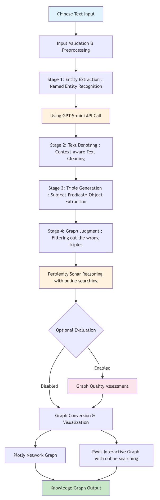

# GraphJudge Streamlit Pipeline: Ancient Chinese Text to Knowledge Graph Processing

This streamlit pipeline is a specialized revision and extension of the research presented in the paper [Can LLMs be Good Graph Judge for Knowledge Graph Construction?](https://arxiv.org/abs/2411.17388). <a href="https://github.com/hhy-huang/GraphJudge" target="_blank">
    
</a>

The pipeline is specifically optimized for **ancient Chinese text processing**, transforming classical Chinese literature (such as 紅樓夢/Dream of the Red Chamber) into high-quality knowledge graphs through a sophisticated three-stage LLM-powered workflow with interactive web interface capabilities.

## Architecture Overview



**Pipeline Flow Description**: The streamlit pipeline processes Chinese text through a four-stage sequential workflow beginning with entity extraction using GPT-5-mini for named entity recognition and context-aware text denoising. The cleaned text then undergoes triple generation to create subject-predicate-object relationships, followed by graph judgment using Perplexity Sonar reasoning to evaluate and filter triples with confidence scoring. Finally, an optional evaluation stage assesses graph quality against reference graphs before converting results into multiple interactive visualization formats including Plotly, Pyvis, and kgGenShows for comprehensive knowledge graph output.

**⚠️ Evaluation Function Status**: Please note that the evaluation functionality is currently incomplete and may produce identical scores across different metrics (G-BLEU, G-ROUGE, G-BertScore) due to fallback mechanisms when certain dependencies are missing. The system falls back to basic word overlap calculations when advanced metric packages like NLTK, rouge-score, or bert-score are unavailable, resulting in identical precision/recall/F1 values that do not reflect the distinct characteristics of each similarity measure.

## Project Structure

```
streamlit_pipeline/
├── README.md                           # Pipeline-specific documentation
├── QUICKSTART.md                       # Quick start guide
├── requirements.txt                    # Core dependencies
├── .env.example                        # API configuration template
├── pytest.ini                         # Test framework configuration
├── run_tests.py                        # Test runner (main entry point)
├── run_app.py                         # Application launcher
├── app.py                             # Main Streamlit application
├── demo_enhanced_pipeline.py          # Demo script with examples
│
├── core/                              # Core pipeline modules
│   ├── __init__.py
│   ├── config.py                      # Configuration management & API setup
│   ├── models.py                      # Data models (Triple, EntityResult, JudgmentResult, etc.)
│   ├── entity_processor.py            # Stage 1: Entity extraction and text denoising
│   ├── triple_generator.py            # Stage 2: Knowledge graph triple generation
│   ├── graph_judge.py                 # Stage 3: Triple validation and judgment
│   └── pipeline.py                    # PipelineOrchestrator - main workflow coordinator
│
├── utils/                             # Utility modules
│   ├── __init__.py
│   ├── api_client.py                  # Unified LLM API wrapper (OpenAI, Perplexity, Azure)
│   ├── validation.py                  # Input validation and sanitization
│   ├── error_handling.py              # Error management and recovery utilities
│   ├── session_state.py               # Streamlit session management
│   ├── detailed_logger.py             # Comprehensive logging system
│   ├── storage_manager.py             # File and data storage management
│   └── state_*.py                     # State management utilities
│
├── ui/                                # Streamlit UI components
│   ├── __init__.py
│   ├── components.py                  # Reusable UI components
│   ├── display.py                     # Result visualization and formatting
│   ├── error_display.py               # Error handling and user feedback
│   └── detailed_progress.py           # Real-time progress tracking
│
├── eval/                              # Graph evaluation system
│   ├── __init__.py
│   ├── graph_evaluator.py             # Main evaluation coordinator
│   └── metrics/                       # Evaluation metrics
│       ├── exact_matching.py          # Exact triple matching metrics
│       ├── semantic_similarity.py     # Semantic similarity evaluation
│       └── text_similarity.py         # Text-based similarity metrics
│
├── tests/                             # Comprehensive test suite
│   ├── __init__.py
│   ├── conftest.py                    # Pytest fixtures and configuration
│   ├── test_models.py                 # Data model validation tests
│   ├── test_config.py                 # Configuration management tests
│   ├── test_validation.py             # Input validation tests
│   ├── test_integration.py            # Cross-module integration tests
│   ├── test_utils.py                  # Testing utilities and helpers
│   └── fixtures/                      # Test data and mock responses
│       ├── __init__.py
│       ├── api_fixtures.py            # Mock API responses
│       └── mock_api_responses.py      # Additional mock data
│
├── datasets/                          # Sample data and processing results
│   ├── iteration_*/                   # Timestamped processing iterations
│   │   ├── entity_results.json        # ECTD stage outputs
│   │   ├── triple_results.json        # Triple generation outputs
│   │   ├── judgment_results.json      # Graph judgment results
│   │   └── graph_data.json            # Final graph visualizations
│   └── original_source/               # Source texts and reference data
│
├── temp/                              # Temporary processing files
├── test_outputs/                      # Test result artifacts
├── logs/                              # Application and processing logs
├── docs/                              # Additional documentation
└── .github/                           # GitHub workflows and CI/CD
    └── workflows/
        └── ci.yml                     # Continuous integration pipeline
```

### Core Architecture Components

#### **Pipeline Orchestrator** (`core/pipeline.py`)
- **PipelineOrchestrator**: Main workflow coordinator managing the complete pipeline
- **PipelineResult**: Comprehensive result container for all stage outputs
- **run_full_pipeline()**: Entry point function for programmatic pipeline execution
- Handles error recovery, progress tracking, and result storage across all stages

#### **Data Models** (`core/models.py`)
- **Triple**: Knowledge graph relationship representation (subject-predicate-object)
- **EntityResult**: Entity extraction and text denoising results container
- **TripleResult**: Triple generation outputs with metadata
- **JudgmentResult**: Graph judgment decisions with confidence scores and explanations
- **EvaluationResult**: Optional graph quality assessment metrics
- **GraphMetrics**: Comprehensive evaluation metrics (F1, BLEU, ROUGE, BERT scores)

#### **Stage Processing Modules**
- **Entity Processor** (`core/entity_processor.py`): GPT-5-mini powered entity extraction and Chinese text denoising
- **Triple Generator** (`core/triple_generator.py`): Subject-predicate-object relationship extraction
- **Graph Judge** (`core/graph_judge.py`): Perplexity Sonar reasoning for triple validation

#### **API Integration** (`utils/api_client.py`)
- Unified interface supporting OpenAI, Azure OpenAI, and Perplexity APIs
- Rate limiting, retry mechanisms, and exponential backoff
- Comprehensive error handling and response validation
- Async operation support for improved performance

## Guidance

### Prerequisites

- **Python 3.8-3.11** (tested and optimized for these versions)
- **API Access**: OpenAI (or Azure OpenAI) and Perplexity API keys
- **System Requirements**: 4GB+ RAM recommended for large text processing

### Quick Start

#### 1. Environment Setup

```bash
# Navigate to streamlit pipeline directory
cd streamlit_pipeline

# Install core dependencies
pip install -r requirements.txt

# Setup environment configuration
cp .env.example .env
```

#### 2. API Configuration

Edit the `.env` file with your API credentials:

```bash
# Option 1: Standard OpenAI (Recommended for research)
OPENAI_API_KEY=your_openai_key_here

# Option 2: Azure OpenAI (Recommended for enterprise)
AZURE_OPENAI_KEY=your_azure_key_here
AZURE_OPENAI_ENDPOINT=https://your-resource.openai.azure.com/

# Required: Perplexity for graph judgment
PERPLEXITY_API_KEY=your_perplexity_key_here

# Optional: Additional judgment providers
KIMI_API_KEY=your_kimi_key_here
GEMINI_API_KEY=your_gemini_key_here
```

#### 3. Verification and Testing

```bash
# Run comprehensive test suite with coverage
python run_tests.py --coverage

# Run integration tests (requires API keys)
python run_tests.py --integration

# Generate HTML coverage report
python run_tests.py --html-coverage
```

#### 4. Launch Application

```bash
# Method 1: Using the launcher script
python run_app.py

# Method 2: Direct Streamlit execution
streamlit run app.py

# Method 3: Demo script with examples
python demo_enhanced_pipeline.py
```

### Core Pipeline Usage

#### **Programmatic API Usage**

```python
import asyncio
from core.pipeline import PipelineOrchestrator
from core.models import Triple

# Initialize pipeline
orchestrator = PipelineOrchestrator()

# Process Chinese text
input_text = "林黛玉是賈寶玉的表妹，她聰明伶俐，才華橫溢。"

# Basic pipeline execution
result = orchestrator.run_pipeline(input_text)

if result.success:
    print(f"Entities found: {len(result.entity_result.entities)}")
    print(f"Triples generated: {len(result.triple_result.triples)}")
    print(f"Approved triples: {result.stats['approved_triples']}")
    print(f"Processing time: {result.total_time:.2f}s")
else:
    print(f"Pipeline failed at {result.error_stage}: {result.error}")
```

#### **Advanced Pipeline Configuration**

```python
# Pipeline with evaluation against reference graph
reference_graph = [
    Triple("林黛玉", "是", "賈寶玉的妹妹),
    Triple("林黛玉", "特點", "聪聰明伶俐"),
    Triple("林黛玉", "特點", "才華洋溢")
]

evaluation_config = {
    'enable_evaluation': True,
    'enable_ged': True,  # Graph Edit Distance (computationally intensive)
    'enable_bert_score': True,
    'max_evaluation_time': 60.0
}

config_options = {
    'enable_explanations': True  # Get detailed reasoning for judgments
}

# Execute with evaluation
result = orchestrator.run_pipeline(
    input_text=input_text,
    config_options=config_options,
    evaluation_config=evaluation_config,
    reference_graph=reference_graph
)

if result.evaluation_enabled and result.evaluation_result.success:
    metrics = result.evaluation_result.metrics
    print(f"Overall Score: {metrics.get_overall_score():.3f}")
    print(f"Triple Match F1: {metrics.triple_match_f1:.3f}")
    print(f"G-BERT F1: {metrics.g_bert_f1:.3f}")
```

#### **Streamlit Integration Patterns**

```python
import streamlit as st
from core.pipeline import PipelineOrchestrator

@st.cache_resource
def get_pipeline_orchestrator():
    """Cached pipeline orchestrator for Streamlit."""
    return PipelineOrchestrator()

def streamlit_progress_callback(stage, message):
    """Progress callback for Streamlit integration."""
    st.session_state.current_stage = stage
    st.session_state.status_message = message

# Streamlit app integration
orchestrator = get_pipeline_orchestrator()
input_text = st.text_area("Enter Chinese text:", height=200)

if st.button("Process Text"):
    with st.spinner("Processing..."):
        result = orchestrator.run_pipeline(
            input_text=input_text,
            progress_callback=streamlit_progress_callback
        )

    # Display results using UI components
    if result.success:
        st.success(f"Pipeline completed in {result.total_time:.2f}s")
        # Display graph visualization, triples, etc.
    else:
        st.error(f"Processing failed: {result.error}")
```

### Advanced Configuration

#### **Model and API Settings** (`core/config.py`)

```python
# Entity Extraction Configuration
ENTITY_MODEL = "gpt-5-mini"  # or "azure/gpt-4o-mini"
ENTITY_TEMPERATURE = 0.0     # Deterministic output
ENTITY_MAX_TOKENS = 4000

# Triple Generation Configuration
TRIPLE_MODEL = "gpt-5-mini"
TRIPLE_TEMPERATURE = 0.1
TRIPLE_MAX_TOKENS = 3000

# Graph Judgment Configuration
JUDGMENT_MODEL = "perplexity/sonar-reasoning"
JUDGMENT_TEMPERATURE = 0.2
JUDGMENT_MAX_TOKENS = 2000

# API Rate Limiting
MAX_REQUESTS_PER_MINUTE = 60
RETRY_ATTEMPTS = 3
BACKOFF_FACTOR = 2.0
```

#### **Evaluation Configuration**

```python
# Evaluation Metrics Configuration
ENABLE_EXACT_MATCHING = True      # Fast exact triple matching
ENABLE_SEMANTIC_SIMILARITY = True # Semantic embedding comparison
ENABLE_TEXT_SIMILARITY = True     # BLEU, ROUGE, BERTScore
ENABLE_GRAPH_EDIT_DISTANCE = False # Computationally intensive

# Performance Limits
MAX_EVALUATION_TIME = 30.0  # seconds
MAX_EVALUATION_TRIPLES = 500
```

**⚠️ Evaluation Function Status**: Please note that the evaluation functionality is currently incomplete and may produce identical scores across different metrics (G-BLEU, G-ROUGE, G-BertScore) due to fallback mechanisms when certain dependencies are missing. The system falls back to basic word overlap calculations when advanced metric packages like NLTK, rouge-score, or bert-score are unavailable, resulting in identical precision/recall/F1 values that do not reflect the distinct characteristics of each similarity measure.

### Testing Framework

#### **Test Categories and Execution**

```bash
# Unit tests (fast, no API calls)
python run_tests.py --unit

# Integration tests (requires API keys)
python run_tests.py --integration

# Performance tests (timing and scalability)
python run_tests.py --performance

# Smoke tests (quick validation)
python run_tests.py --smoke

# Comprehensive testing with coverage
python run_tests.py --coverage --verbose
```

#### **Test Structure**

- **Unit Tests**: Individual component testing with mocks
- **Integration Tests**: Cross-module and API integration testing
- **Performance Tests**: Timing, memory usage, and scalability validation
- **Mock API Tests**: Simulated API responses for reliable testing
- **Coverage Reports**: HTML and terminal coverage reporting with 90%+ requirement

### Data Storage and Session Management

#### **Storage System** (`utils/storage_manager.py`)
- **Iteration-based Storage**: Each pipeline run creates a timestamped iteration folder
- **Multi-format Support**: JSON, CSV, and graph-specific formats
- **Automatic Organization**: Results organized by processing stage and timestamp
- **Export Capabilities**: Multiple export formats for downstream analysis

#### **Session State Management** (`utils/session_state.py`)
- **Streamlit Integration**: Persistent session state across page reloads
- **Processing History**: Track multiple runs within a single session
- **Error Recovery**: Maintain state during error conditions
- **Progress Tracking**: Real-time progress updates and stage management

### Monitoring and Debugging

#### **Comprehensive Logging** (`utils/detailed_logger.py`)

```python
# Enable debug logging
import os
os.environ['LOG_LEVEL'] = 'DEBUG'

# Detailed processing logs available at:
# - logs/pipeline_YYYYMMDD_HHMMSS.log
# - Real-time Streamlit console output
# - Per-stage timing and performance metrics
```

#### **Error Handling and Recovery**

- **Stage-specific Error Isolation**: Failures don't cascade across stages
- **Automatic Retry Logic**: Configurable retry attempts with exponential backoff
- **User-friendly Error Messages**: Clear error descriptions with recovery suggestions
- **Graceful Degradation**: Partial results available even with stage failures

### Visualization and Export

#### **Multi-format Graph Visualization**
- **Plotly**: Interactive network graphs with hover details and filtering
- **Pyvis**: Advanced network visualization with physics simulation
- **kgGenShows**: Compatible format for external knowledge graph tools

#### **Export Formats**
- **JSON**: Complete pipeline results with metadata
- **CSV**: Triple lists and judgment results for analysis
- **Graph Formats**: Multiple graph formats for different visualization tools
- **Evaluation Reports**: Comprehensive metrics and assessment results (see evaluation status warning above)

### Troubleshooting

#### **Common Issues and Solutions**

1. **API Configuration Errors**
   ```bash
   # Verify API keys are correctly set
   python -c "from core.config import get_api_config; print(get_api_config())"
   ```

2. **Import and Path Issues**
   ```bash
   # Run from streamlit_pipeline directory
   cd streamlit_pipeline
   python -c "import core.models; print('Imports successful')"
   ```

3. **Memory Issues with Large Texts**
   ```bash
   # Monitor memory usage and consider text chunking
   python run_tests.py --performance
   ```

4. **Test Failures**
   ```bash
   # Debug with verbose output
   python run_tests.py --verbose --pattern "test_specific_function"
   ```

## Performance Optimization

### **Async Operations**
- All API calls use async/await patterns for improved throughput
- Concurrent processing where possible while respecting API rate limits
- Non-blocking UI updates during long-running operations

### **Caching and Storage**
- Intelligent caching of API responses to reduce redundant calls
- Persistent storage of intermediate results for pipeline resumption
- Session-based caching for improved user experience

### **Resource Management**
- Automatic cleanup of temporary files and processing artifacts
- Memory-efficient processing for large text inputs
- Configurable resource limits and timeouts

## Citation

If you use this streamlit pipeline in your research, please cite the original GraphJudge paper:

```bibtex
@misc{huang2025llmsgoodgraphjudge,
      title={Can LLMs be Good Graph Judge for Knowledge Graph Construction?},
      author={Haoyu Huang and Chong Chen and Zeang Sheng and Yang Li and Wentao Zhang},
      year={2025},
      eprint={2411.17388},
      archivePrefix={arXiv},
      primaryClass={cs.CL},
      url={https://arxiv.org/abs/2411.17388},
}
```

---

**For comprehensive documentation on the broader GraphJudge research project, please refer to the main repository README.**