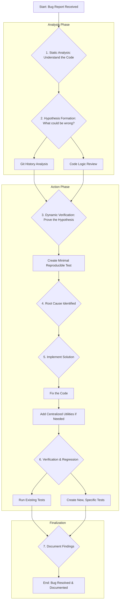

# Professional Engineer's Debugging Guide

This guide outlines a systematic and efficient methodology for debugging complex software issues, inspired by best practices at top engineering firms like Google. The process emphasizes understanding the system's behavior over making blind guesses, leading to more robust and permanent fixes.

## 1. The Debugging Flowchart



## 2. Detailed Explanation of the Flow

This process follows a logical progression from understanding to fixing and, finally, to preventing future issues.

### Step 1: Static Analysis - Read the Code First
Before running anything, understand the landscape. When a bug is reported (e.g., "a file is missing between two pipeline stages"), the first step is to read the relevant code. When read the revelant code, need to read the README.md first to overall understand the structure of this project, and find out the main code, and its affiliated code, then read their comments, header, and the function to mainly understand what the function doing, and why to write that.
- **Objective:** Understand the intended logic. How *should* it work?
- **Example:** In our case, we read `run_entity.py` (the writer) and `run_triple.py` (the reader) to see how they handled file paths. We identified that they were both responsible for constructing a path to an output/input directory.

### Step 2: Hypothesis Formation - What Could Be Wrong?
Based on your static analysis, form an educated guess. Avoid random changes.
- **Objective:** Create a specific, testable theory about the cause of the bug.
- **Key Tools:**
    - **Git History Analysis (`git blame`):** This is invaluable. Check who last touched the relevant lines of code and why. A recent change is a prime suspect.
    - **Code Logic Review:** Look for inconsistencies, edge cases, or potential race conditions.
- **Example:** We hypothesized that the path generation logic was inconsistent between the two scripts. `git blame` confirmed our suspicion by pointing to a recent commit (`0d6d720`) that introduced an environment variable override to `run_entity.py` but not to `run_triple.py`. This was our "smoking gun."

### Step 3: Dynamic Verification - Prove the Hypothesis
Don't fix anything yet. First, prove that your hypothesis is correct with a minimal, targeted test.
- **Objective:** Create a simple, isolated test case that reliably reproduces the bug. This confirms you've found the root cause and not just a symptom.
- **Example:** We created `test_path_fix.py`. This script didn't run the whole pipeline; it *only* tested the path generation logic from both original files under different conditions (with and without the environment variable). It failed as expected, proving our hypothesis was correct.

### Step 4: Root Cause Identified
With a failing test that confirms your hypothesis, you have officially found the root cause. The problem is no longer a mystery.
- **Example:** The root cause was not just a typo, but a design flaw: two modules independently calculated the same critical path, and a change in one was not reflected in the other.

### Step 5: Implement the Solution
Now, and only now, do you write the code to fix the bug.
- **Objective:** Write clean, correct code that fixes the root cause.
- **Best Practice:** Consider if a broader architectural improvement is needed. Instead of just patching the problem, can you prevent similar problems in the future?
- **Example:**
    1.  We first made `run_triple.py` use the same environment variable logic as `run_entity.py`.
    2.  Then, we improved the design by creating centralized utility functions (`get_iteration_output_path`, `get_iteration_input_path`) in `config.py` to ensure that path logic was defined in only one place (Single Source of Truth).

### Step 6: Verification & Regression Testing
Your fix isn't complete until you've proven it works and ensured it can't happen again.
- **Objective:** Verify the fix and create a safety net to catch regressions.
- **Actions:**
    1.  **Run existing tests:** Make sure your fix didn't break anything else.
    2.  **Create a new, specific test:** This is the most critical part. The minimal test from Step 3 can now be adapted into a permanent automated test. This new test should have failed *before* your fix and must pass *after* it.
- **Example:** We added the `TestFileTransferPathConsistency` class to the unit test suite. This test simulates the exact file transfer scenario and explicitly checks for path consistency, ensuring this specific bug never silently reappears.

### Step 7: Document Findings
If the bug was complex, document the "what" and "why" for future engineers (and your future self).
- **Objective:** Share knowledge and save future debugging time.
- **Example:** This `ProEngineer_DebugGuide.md` is a form of documentation, capturing the methodology used to solve the problem. A good commit message or a link to the bug ticket also serves this purpose.

## 3. Reusable AI Prompt for Structured Debugging

You can use the following prompt with an AI assistant to guide it through this professional debugging process.

```
You are an expert-level software engineer. I am facing a bug, and I need you to help me solve it using a systematic, professional debugging methodology.

**The Bug:**
[Clearly describe the bug symptom here. For example: "When I run my CLI pipeline, the 'run_triple' stage fails because it cannot find the 'test_entity.txt' file that the 'run_entity' stage was supposed to create. However, my unit tests are all passing."]

**Your Task:**
Guide me through the debugging process step-by-step. Do not jump to conclusions or suggest code changes immediately. Follow this structured flow:

1.  **Static Analysis:** First, identify the key files and code sections related to the bug. When read the revelant code, need to read the README.md first to overall understand the structure of this project, and find out the main code, and its affiliated code, then read their comments, header, and the function to mainly understand what the function doing, and why to write that. Your goal is to understand the intended logic.
2.  **Hypothesis Formation:** Based on the code, form a primary hypothesis about the root cause. Use `git blame` or ask about recent changes to inform your hypothesis. State your hypothesis clearly.
3.  **Dynamic Verification:** Propose a plan to verify the hypothesis with a minimal, targeted test. This could be a small, temporary script or a specific API call. The goal is to prove the root cause, not to fix it yet.
4.  **Solution Implementation:** Once the root cause is confirmed, propose a code change to fix it. Look for opportunities to improve the design to prevent similar bugs in the future (e.g., centralizing logic).
5.  **Regression Testing:** Propose a new, permanent automated test that would have caught this bug. This test must fail before the fix and pass after it.
6.  **Final Summary:** Provide a summary of the root cause, the fix, and the lesson learned.

Begin with Step 1: Static Analysis.
```
