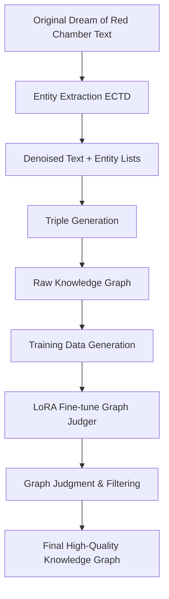

# High-Quality Knowledge Graph Implementation Guide for "Dream of the Red Chamber"

This document provides a detailed guide on using the GraphJudge project to convert "Dream of the Red Chamber" text into a high-quality knowledge graph. GraphJudge is a three-stage pipeline consisting of Entity Extraction and Text Denoising (ECTD), Knowledge Graph Supervised Fine-Tuning (KASFT), and Graph Judgment (GJ).

## Complete Pipeline Overview



The process is divided into three main blocks:

1. **Local (or Low RAM Environment) Steps** – Use OpenAI/Azure OpenAI API for "Entity Extraction + Denoising" and "Triple Generation"
2. **Azure GPU Environment Steps** – Perform LoRA fine-tuning and inference (high memory requirements)
3. **Graph Filtering and Evaluation** – Can return to local machine or continue on Azure

> All shell commands in this document start with `$`; remove `$` according to your actual environment when executing.

---
## 0. Prerequisites

| Category | Requirements |
|----------|-------------|
| Accounts | ① OpenAI API Key (or Azure OpenAI Service) ② Azure Subscription (for creating GPU VM or Azure ML) |
| Local Environment | Python 3.9+, git, (optional) conda/venv |
| Azure GPU | Recommended: `Standard_NVadsA10_v5` (A10 24 GB) or T4 16 GB + 4-bit quantization |
| File Preparation | Dream of Red Chamber text segmented by paragraphs, UTF-8 encoding |

---
## 1. Data Preparation and Environment Setup

### 1-1 API Configuration Setup

First, set up the OpenAI API key. Create a `.env` file in the project root or set environment variables:

```bash
# Method 1: Environment variable setup
$ export OPENAI_API_KEY="your-openai-api-key-here"
$ export OPENAI_API_BASE="https://api.openai.com/v1"  # or Azure OpenAI endpoint

# Method 2: Check existing config.py settings
$ cd Miscellaneous/KgGen/GraphJudge/chat
$ python config.py  # Verify API configuration
```

### 1-2 Prepare Dream of Red Chamber Text Data

1. **Text Format Requirements**:
   - One paragraph or sentence per line
   - UTF-8 encoding
   - Recommended length: 50-200 characters per line
   
2. **Example Text Format**:
   ```
   第一回　甄士隱夢幻識通靈　賈雨村風塵懷閨秀
   此開卷第一回也。作者自云：因曾歷過一番夢幻之後，故將真事隱去，而借「通靈」之說，撰此《石頭記》一書也。
   姑蘇城有一士隱，名費，字士隱，本貫大如州人氏，祖上也是讀書仕宦之族。
   賈寶玉因為夢遊太虛幻境，頓生疑懼。
   ```

3. **Create Data Structure**:
   ```bash
   $ mkdir -p datasets/GPT4o_mini_result_HongLouMeng/Iteration1
   $ mkdir -p datasets/GPT4o_mini_result_HongLouMeng/Graph_Iteration1
   
   # Place processed text:
   $ cp dream_of_red_chamber_processed.txt datasets/GPT4o_mini_result_HongLouMeng/test.target
   ```

### 1-3 Install Dependencies

```bash
$ cd Miscellaneous/KgGen/GraphJudge
$ pip install openai asyncio tqdm python-dotenv
$ pip install transformers torch  # If running LoRA locally
```

---
## 2. Entity Extraction + Denoising (ECTD)

### 2-1 Modify `chat/run_chatgpt_entity.py`

Based on code analysis, modify the following key parameters:

```python
# Line 35: Modify dataset name
dataset = "HongLouMeng"  # Originally "GenWiki-Hard"

# Line 38: Set iteration number
Iteration = 1  # First round processing

# Lines 133-147: Update entity extraction prompt with Chinese examples
prompt = f"""
Goal:
Transform the text into a list of entities.

Here are two examples:
Example#1:
Text: "賈寶玉因夢遊太虛幻境，頓生疑懼。"
List of entities: ["賈寶玉", "太虛幻境"]
Example#2:
Text: "林黛玉住在榮國府，與賈母一同生活。"
List of entities: ["林黛玉", "榮國府", "賈母"]

Refer to the examples and here is the question:
Text: "{t}"
List of entities: """

# Lines 181-197: Update denoising prompt with Chinese examples
prompt = f"""
Goal:
Denoise the raw text with the given entities, which means remove the unrelated text and make it more formatted.

Here are two examples:
Example#1:
Raw text: "賈寶玉，榮國府嫡派孫子，生性喜歡讀書。然而在太虛幻境遊歷後，對人生產生懷疑。"
Entities: ["賈寶玉", "榮國府", "太虛幻境"]
Denoised text: "賈寶玉是榮國府的人。賈寶玉曾經夢遊太虛幻境。賈寶玉對人生產生懷疑。"
Example#2:
Raw text: "林黛玉自幼失去雙親，寄居在外祖母賈母家中，即榮國府。她與表哥賈寶玉情投意合。"
Entities: ["林黛玉", "賈母", "榮國府", "賈寶玉"]
Denoised text: "林黛玉失去雙親。林黛玉寄居在賈母家中。賈母住在榮國府。林黛玉與賈寶玉情投意合。"

Refer to the examples and here is the question:
Raw text: {t}
Entities: {entities}
Denoised text: """
```

### 2-2 Execute Entity Extraction and Denoising

```bash
$ cd Miscellaneous/KgGen/GraphJudge
$ python chat/run_chatgpt_entity.py
```

### 2-3 Program Execution Process

1. **Load Text**: Read from `datasets/GPT4o_mini_result_HongLouMeng/test.target`
2. **Entity Extraction**: Use GPT-4o-mini with concurrent processing (max 8 concurrent requests)
3. **Save Entities**: Write to `Iteration1/test_entity.txt`
4. **Denoising Processing**: Reformat text based on extracted entities
5. **Save Denoised Text**: Write to `Iteration1/test_denoised.target`

### 2-4 Expected Output

```
datasets/GPT4o_mini_result_HongLouMeng/Iteration1/
 ├─ test_entity.txt            # One entity list per line, e.g.: ["Jia Baoyu", "Land of Illusion"]
 └─ test_denoised.target       # Denoised structured text
```

### 2-5 Multi-round Iteration (Optional)

To improve quality, perform a second round:

```python
# Modify Iteration = 2, the program will automatically read Iteration1/test_denoised.target as input
Iteration = 2
```

> **Note**: Remember to create the `Iteration2` folder before executing the second round.

---
## 3. Triple Generation

### 3-1 Modify `chat/run_chatgpt_triple.py`

Based on code analysis, modify the following key parameters:

```python
# Line 43: Modify dataset name
dataset = "HongLouMeng"  # Originally "GenWiki-Hard"

# Lines 46-47: Set iteration parameters
Denoised_Iteration = 1   # Read first round denoising results
Graph_Iteration    = 1   # Output triples to first round

# Lines 134-153: Update triple generation prompt with Chinese examples
prompt = (
    f"Goal:\nTransform the text into a semantic graph(a list of triples) with the given text and entities. "
    f"In other words, You need to find relations between the given entities with the given text.\n"
    f"Attention:\n1.Generate triples as many as possible. "
    f"2.Make sure each item in the list is a triple with strictly three items.\n\n"
    f"Here are two examples:\n"
    # 紅樓夢相關範例
    f"Example#1: \nText: \"賈寶玉住在榮國府，與林黛玉情投意合。\"\n"
    f"Entity List: [\"賈寶玉\", \"榮國府\", \"林黛玉\"]\n"
    f"Semantic Graph: [[\"賈寶玉\", \"居住地\", \"榮國府\"], "
    f"[\"賈寶玉\", \"情感關係\", \"林黛玉\"]]\n"
    # 第二個範例
    f"Example#2:\nText: \"林黛玉是賈母的外孫女，父親林如海已故，寄居在榮國府。\"\n"
    f"Entity List: [\"林黛玉\", \"賈母\", \"林如海\", \"榮國府\"]\n"
    f"Semantic Graph: [[\"林黛玉\", \"親屬關係\", \"賈母\"], [\"林黛玉\", \"父親\", \"林如海\"], "
    f"[\"林如海\", \"生存狀態\", \"已故\"], [\"林黛玉\", \"居住地\", \"榮國府\"]]\n\n"
    # 實際任務
    f"Refer to the examples and here is the question:\nText: {text[i]}\nEntity List:{entity[i]}\nSemantic graph:"
)
```

### 3-2 Execute Triple Generation

```bash
$ cd Miscellaneous/KgGen/GraphJudge
$ python chat/run_chatgpt_triple.py
```

### 3-3 Program Execution Process

1. **Load Denoised Text**: Read from `Iteration1/test_denoised.target`
2. **Load Entity Lists**: Read from `Iteration1/test_entity.txt`
3. **Generate Triples**: Use GPT-3.5-turbo with temperature 0.1 for consistency
4. **Concurrent Processing**: Max 8 concurrent requests for efficiency
5. **Save Results**: Write to `Graph_Iteration1/test_generated_graphs.txt`

### 3-4 Expected Output Format

```
datasets/GPT4o_mini_result_HongLouMeng/Graph_Iteration1/test_generated_graphs.txt
```

每行包含一個文本對應的三元組列表，格式如：
```
[["賈寶玉", "居住地", "榮國府"], ["賈寶玉", "情感關係", "林黛玉"]]
[["林黛玉", "親屬關係", "賈母"], ["林黛玉", "父親", "林如海"]]
```

### 3-5 Quality Verification

Generated triples should have:
- **Completeness**: Each triple has subject, predicate, object
- **Accuracy**: Relationship descriptions match original text meaning
- **Consistency**: Entity names remain consistent with previously extracted ones

---
## 4. LoRA Fine-tuning Graph Judger (Azure GPU Section)

This step uses LoRA (Low-Rank Adaptation) technique to fine-tune LLaMA model, training a specialized graph judger to filter inaccurate triples.

### 4-1 Prepare Training Data (Local Execution)

First use `prepare_KGCom.ipynb` to generate training instructions:

```python
# Execute the first cell of prepare_KGCom.ipynb in datasets/ folder
# Modify the following parameters:
dataset_path = './GPT4o_mini_result_HongLouMeng/'

# This generates positive and negative samples from train.source:
# Positive: ["instruction": "Is this true: 賈寶玉 居住地 榮國府?", "output": "Yes, this is true."]
# Negative: ["instruction": "Is this true: 賈寶玉 居住地 太虛幻境?", "output": "No, this is not true."]
```

Generated file: `datasets/GPT4o_mini_result_HongLouMeng/train_instructions_llama.json`

### 4-2 Create Azure GPU VM

```bash
# Install Azure CLI and login
$ az login
$ az group create --location eastasia --name rc-kg-rg

# Create A10 GPU VM (24GB VRAM)
$ az vm create \
    --resource-group rc-kg-rg \
    --name rc-kg-a10 \
    --image Canonical:0001-com-ubuntu-server-jammy:22_04-lts-gen2:latest \
    --size Standard_NVadsA10_v5 \
    --admin-username azureuser \
    --generate-ssh-keys

# Get VM's public IP
$ az vm list-ip-addresses --resource-group rc-kg-rg --name rc-kg-a10 --output table
```

### 4-3 Azure VM Environment Setup

```bash
# SSH connect to VM
$ ssh azureuser@<VM_PUBLIC_IP>

# Update system and install NVIDIA drivers
$ sudo apt update && sudo apt upgrade -y
$ sudo apt install -y nvidia-driver-525 nvidia-utils-525
$ sudo reboot  # Reboot and SSH connect again

# Install CUDA 11.8 and development tools
$ wget https://developer.download.nvidia.com/compute/cuda/11.8.0/local_installers/cuda_11.8.0_520.61.05_linux.run
$ sudo sh cuda_11.8.0_520.61.05_linux.run --toolkit --silent
$ echo 'export PATH=/usr/local/cuda-11.8/bin:$PATH' >> ~/.bashrc
$ echo 'export LD_LIBRARY_PATH=/usr/local/cuda-11.8/lib64:$LD_LIBRARY_PATH' >> ~/.bashrc
$ source ~/.bashrc

# Install Python environment
$ sudo apt install -y python3-pip python3-venv git
$ git clone https://github.com/<your_fork>/2025-IM-senior-project.git
$ cd 2025-IM-senior-project/Miscellaneous/KgGen/GraphJudge
$ python3 -m venv .venv && source .venv/bin/activate

# Install PyTorch and related packages
(.venv) $ pip install torch==2.2.2+cu118 torchvision torchaudio --index-url https://download.pytorch.org/whl/cu118
(.venv) $ pip install transformers==4.36.0 peft==0.7.1 accelerate datasets bitsandbytes einops tqdm pandas
```

### 4-4 Upload Training Data and Setup Paths

```bash
# On local machine: upload training data
$ scp datasets/GPT4o_mini_result_HongLouMeng/train_instructions_llama.json \
    azureuser@<VM_PUBLIC_IP>:~/2025-IM-senior-project/Miscellaneous/KgGen/GraphJudge/graph_judger/data/

# On VM: create folder structure
(.venv) $ mkdir -p graph_judger/data/hongloumeng
(.venv) $ mv graph_judger/data/train_instructions_llama.json graph_judger/data/hongloumeng/
```

### 4-5 Create and Modify LoRA Fine-tuning Script

```bash
# Copy existing script as template
(.venv) $ cp graph_judger/lora_finetune_genwiki_context.py \
            graph_judger/lora_finetune_hlm_context.py
```

Modify key parameters:

```python
# graph_judger/lora_finetune_hlm_context.py

# Line 30: Data path
DATA_PATH = "data/hongloumeng/train_instructions_llama.json"

# Lines 40-44: Batch size settings (adjust for A10 24GB)
MICRO_BATCH_SIZE = 4  # A10 24GB can use 4; T4 16GB recommend 2
BATCH_SIZE = 128
GRADIENT_ACCUMULATION_STEPS = BATCH_SIZE // MICRO_BATCH_SIZE

# Line 58: Output path
OUTPUT_DIR = "models/llama3-8b-instruct-lora-hlm-context"

# Line 61: Base model path (can use HuggingFace path)
base_model_path = "meta-llama/Llama-2-7b-hf"  # or use "NousResearch/Llama-2-7b-hf"

# Line 97: Enable 4-bit quantization (save memory)
model = LlamaForCausalLM.from_pretrained(
    base_model_path,
    load_in_4bit=True,  # Enable 4-bit quantization
    torch_dtype=torch.float16,
)
```

### 4-6 Execute LoRA Fine-tuning

```bash
(.venv) $ python graph_judger/lora_finetune_hlm_context.py
```

Expected output:
- Training process will show decreasing loss
- After completion, generate LoRA weights in `models/llama3-8b-instruct-lora-hlm-context/`

### 4-7 Generate Test Data and Execute Inference

```bash
# Use the 4th cell of prepare_KGCom.ipynb to generate test instructions
# Modify parameters:
dataset_path = './GPT4o_mini_result_HongLouMeng/'
Iteration = 1

# This generates CSV file from Graph_Iteration1/test_generated_graphs.txt
# Output: test_instructions_context_llama2_7b_itr1.csv
```

Upload test file and execute inference:

```bash
# Local machine upload test data
$ scp datasets/GPT4o_mini_result_HongLouMeng/Graph_Iteration1/test_instructions_context_llama2_7b_itr1.csv \
    azureuser@<VM_PUBLIC_IP>:~/2025-IM-senior-project/Miscellaneous/KgGen/GraphJudge/graph_judger/data/hongloumeng/

# VM execute inference
(.venv) $ python graph_judger/lora_infer_batch.py
# Note: Need to modify LORA_WEIGHTS path and input file path in the script
```

### 4-8 Memory Optimization Recommendations

**A10 24GB Settings**:
- `MICRO_BATCH_SIZE = 4`
- `load_in_4bit = True`
- `torch_dtype = torch.float16`

**T4 16GB Settings**:
- `MICRO_BATCH_SIZE = 1`
- `load_in_4bit = True`
- `gradient_checkpointing = True`

**Cost Control**:
- A10 VM costs about USD 1.2/hour
- Complete fine-tuning takes about 2-3 hours
- Remember to stop VM after completion to save costs

---
## 5. Graph Filtering and Final Output

### 5-1 Download Inference Results and Perform Filtering

```bash
# Download inference results from Azure VM
$ scp azureuser@<VM_PUBLIC_IP>:~/2025-IM-senior-project/Miscellaneous/KgGen/GraphJudge/graph_judger/pred_instructions_context_llama2_7b_itr1.csv \
    datasets/GPT4o_mini_result_HongLouMeng/Graph_Iteration1/

# Stop Azure VM to save costs
$ az vm deallocate --resource-group rc-kg-rg --name rc-kg-a10
```

### 5-2 Execute Graph Filtering

Use the 7th cell of `prepare_KGCom.ipynb` for filtering:

```python
# Modify parameters
triples = []
dataset_path = './GPT4o_mini_result_HongLouMeng/'
Iteration = 1
IF_simplebase = False

# Load triples
with open(dataset_path + f'Graph_Iteration{Iteration}/test_generated_graphs.txt', 'r') as f:
    for l in f.readlines():
        triples.append(ast.literal_eval(l.strip()))

# Load inference results
pred_res = pd.read_csv(dataset_path + f'Graph_Iteration{Iteration}/pred_instructions_context_llama2_7b_itr1.csv', 
                      header=0, sep=',')

# Filtering logic: responses containing "no" or "false" are considered incorrect
res_list = []
for index, data in tqdm(pred_res.iterrows()):
    try:
        response = data['generated'].lower()
        if 'no' in response[:100] or 'false' in response[:100]:
            res_list.append(False)  # Mark as incorrect
        else:
            res_list.append(True)   # Mark as correct
    except:
        res_list.append(False)

# Apply filtering results
new_triples = []
i = 0
for triple_list in triples:
    new_triple_list = []
    for triple in triple_list:
        if res_list[i]:  # Only keep triples judged as correct
            new_triple_list.append(triple)
        i += 1
    new_triples.append(new_triple_list)

# Save final results
with open(dataset_path + f'Graph_Iteration{Iteration}/test_generated_graphs_final.txt', 'w') as f:
    for doc in new_triples:
        f.write(str(doc) + '\n')
```

### 5-3 Quality Assessment

The final file `test_generated_graphs_final.txt` contains high-quality triples filtered by Graph Judger.

**Evaluation Metrics**:
- **Triple Retention Rate**: Proportion of triples remaining after filtering
- **Relationship Accuracy**: Manual sampling to check if relationships are correct
- **Entity Consistency**: Whether entity names are consistent with original text

---
## 6. Azure OpenAI Integration (Alternative)

If you don't want to use public OpenAI API, you can use Azure OpenAI Service:

### 6-1 Create Azure OpenAI Resource

```bash
# Create Azure OpenAI resource
$ az cognitiveservices account create \
    --name rc-openai \
    --resource-group rc-kg-rg \
    --location eastus \
    --kind OpenAI \
    --sku S0 \
    --subscription <your-subscription-id>

# Deploy model
$ az cognitiveservices account deployment create \
    --name rc-openai \
    --resource-group rc-kg-rg \
    --deployment-name gpt-4o-mini \
    --model-name gpt-4o-mini \
    --model-version "2024-07-18" \
    --model-format OpenAI \
    --capacity 120
```

### 6-2 Modify API Configuration

Update `chat/config.py`:

```python
import os
from typing import Tuple

def get_api_config() -> Tuple[str, str]:
    """Azure OpenAI Configuration"""
    # Prioritize Azure OpenAI
    azure_key = os.getenv('AZURE_OPENAI_KEY', '').strip()
    azure_endpoint = os.getenv('AZURE_OPENAI_ENDPOINT', '').strip()
    
    if azure_key and azure_endpoint:
        return azure_key, azure_endpoint
    
    # Fallback: use standard OpenAI
    api_key = os.getenv('OPENAI_API_KEY', '').strip()
    api_base = os.getenv('OPENAI_API_BASE', 'https://api.openai.com/v1').strip()
    
    if not api_key:
        raise ValueError("Please set AZURE_OPENAI_KEY or OPENAI_API_KEY")
    
    return api_key, api_base
```

### 6-3 Set Environment Variables

```bash
$ export AZURE_OPENAI_KEY="your-azure-openai-key"
$ export AZURE_OPENAI_ENDPOINT="https://rc-openai.openai.azure.com/"
$ export AZURE_OPENAI_DEPLOYMENT="gpt-4o-mini"
```

### 6-4 Modify API Calls

In `run_chatgpt_entity.py` and `run_chatgpt_triple.py`:

```python
# When using Azure OpenAI, need to specify deployment
response = await openai_async_client.chat.completions.create(
    model=os.getenv('AZURE_OPENAI_DEPLOYMENT', 'gpt-4o-mini'),
    messages=messages,
    temperature=0,
    **kwargs
)
```

---
## 7. Multi-round Iteration Recommendations

### 7-1 Iteration Strategy

| Round | Action | Input Source | Purpose |
|-------|--------|--------------|---------|
| Iter 1 | Original paragraphs → extract entities / denoise | `test.target` | Establish baseline text and entities |
| Iter 2 | Rerun using Iter1 denoised text | `Iteration1/test_denoised.target` | Fix errors, supplement entities |
| Iter 3 | Continue iteration if needed | `Iteration2/test_denoised.target` | Further improve coverage |

### 7-2 Parameter Update Process

Each iteration requires updating the following parameters:

```python
# run_chatgpt_entity.py
Iteration = 2  # Second round

# run_chatgpt_triple.py  
Denoised_Iteration = 2  # Read second round denoising results
Graph_Iteration = 2     # Output to second round graph

# prepare_KGCom.ipynb
Iteration = 2  # Process second round data
```

### 7-3 Quality Improvement Tracking

After each iteration, compare:
- **Entity Recall Rate**: What important entities were added
- **Denoising Quality**: Whether text structure is clearer
- **Triple Accuracy**: Whether relationship descriptions are more precise

---
## 8. Optimization Tips and Troubleshooting

### 8-1 Prompt Engineering Tips

1. **Chinese-specific Examples**:
   ```python
   # 針對紅樓夢的專門範例
   Example: "賈寶玉字怡紅公子，是榮國府賈政與王夫人之子"
   Entities: ["賈寶玉", "怡紅公子", "榮國府", "賈政", "王夫人"]
   ```

2. **Entity Consistency**:
   - Unify names: 賈寶玉 vs 寶玉 vs 怡紅公子
   - Unify place names: 榮國府 vs 榮府
   - Unify traditional/simplified characters: 寧國府 vs 宁国府

### 8-2 Common Problem Solutions

**Out of Memory (OOM)**:
```python
# Reduce batch size
MICRO_BATCH_SIZE = 1
# Enable gradient checkpointing
gradient_checkpointing = True
# Use 4-bit quantization
load_in_4bit = True
```

**API Rate Limiting**:
```python
# Reduce concurrency
max_concurrent = 4  # Reduce from 8 to 4
# Add delay
await asyncio.sleep(0.1)
```

**Azure VM Connection Issues**:
```bash
# Check firewall rules
$ az vm list-ip-addresses --output table
$ az network nsg rule list --resource-group rc-kg-rg --nsg-name <nsg-name>
```

### 8-3 Cost Optimization Strategies

**Development Phase**:
- Use T4 16GB VM (`Standard_NC4as_T4_v3`)
- Enable 4-bit quantization
- Test with smaller datasets

**Production Phase**:
- Upgrade to A10 24GB or A100 80GB
- Use Azure Machine Learning Spot instances
- Set up automatic shutdown to control costs

---
## 9. Evaluation and Validation

### 9-1 Automated Evaluation

Use `graph_evaluation/eval.sh`:

```bash
# Modify evaluation script path
$ vim graph_evaluation/eval.sh

# Update to Dream of Red Chamber data path
python metrics/eval.py \
    --pred_file ../datasets/GPT4o_mini_result_HongLouMeng/Graph_Iteration1/test_generated_graphs_final.txt \
    --gold_file ../datasets/GPT4o_mini_result_HongLouMeng/test.source

# Execute evaluation
$ cd graph_evaluation
$ bash eval.sh
```

### 9-2 Manual Evaluation Metrics

**Entity Evaluation**:
- Recall Rate: Whether important characters and locations are all identified
- Precision Rate: Whether identified entities actually exist in the text

**Relationship Evaluation**:
- Semantic Correctness: Whether relationship descriptions match original text meaning
- Completeness: Whether important relationships are all extracted

**Overall Quality**:
- Whether the knowledge graph can answer common questions about Dream of Red Chamber
- Whether entity connections form a reasonable semantic network

---
## 10. Conclusion and Next Steps

### 10-1 Complete Process Summary

Through the above steps, you can complete high-quality knowledge graph construction for "Dream of the Red Chamber" in a **low RAM laptop + Azure GPU** hybrid environment:

1. **Lightweight Steps** (Local): Entity extraction, denoising, triple generation
2. **Heavy Steps** (Azure): LoRA fine-tuning, large model inference
3. **Post-processing Steps** (Local): Graph filtering, quality assessment

### 10-2 Flexible Solution Choices

**Basic Version** (Low Cost):
- Only execute Steps 1-3, directly use GPT-generated triples
- Estimated cost: API call fees about $10-50

**Advanced Version** (High Quality):
- Include complete workflow with LoRA fine-tuning
- Estimated cost: Azure GPU + API about $20-100

### 10-3 Application Extensions

**Other Literary Works**:
- Change dataset names and examples to apply to "Water Margin", "Journey to the West", etc.
- Adjust entity categories (characters, locations, objects, etc.) to fit different work characteristics

**Domain Knowledge Graphs**:
- Medical Literature → Disease, drug, symptom relationships
- Legal Documents → Statute, case, judgment relationships  
- Technical Papers → Concept, method, application relationships

Wish you success in your research and project development! Feel free to discuss further if you have any questions.