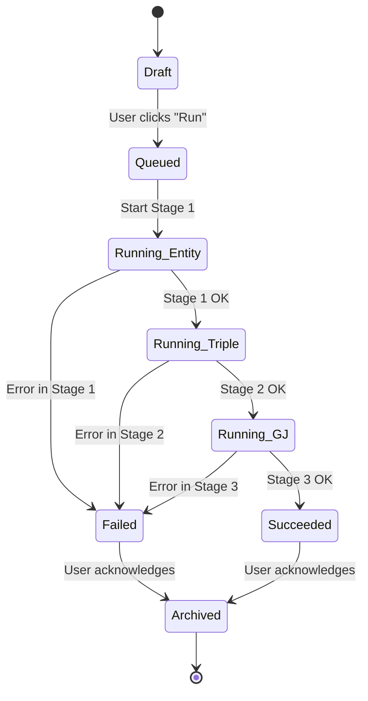

# GraphJudge Orchestrator: Design Document

**Version:** 1.0
**Date:** 2025-09-11
**Status:** Draft
**Author:** GitHub Copilot (as Senior Software Engineer)
**Reviewers:** {{Technical Lead}}, {{Product Manager}}

---

## 1) Abstract

This document specifies the design for the **GraphJudge Orchestrator**, a Streamlit web application that provides a user-friendly interface for an end‑to‑end Knowledge Graph (KG) creation pipeline. The application orchestrates three distinct NLP inference stages: Entity Extraction, Triple Generation, and Graph Judging, by calling existing Python scripts (`run_entity.py`, `run_triple.py`, `run_gj.py`). The primary goal is to simplify the execution of this complex workflow, which currently relies on manual CLI execution and file management. The proposed solution is a monolithic Streamlit application that directly imports and calls the core logic from these scripts, using file-based caching and state management to handle the multi-step process. Key decisions include avoiding a microservices architecture for simplicity and using environment variables for managing API keys. The main risks involve the tight coupling to the existing script structure and potential performance bottlenecks from long-running, synchronous inference tasks. Success will be measured by a reduction in the end‑to‑end processing time for a user, increased successful pipeline runs, and positive feedback from research users. The application will be rolled out internally to the research team.

This design provides a pragmatic path to delivering a valuable internal tool by wrapping existing logic in a user-friendly interface.

## 2) Introduction

-   **Context:** The current process for generating and validating knowledge graphs from text involves running a sequence of Python scripts from the command line. This process is error-prone, requires manual file handling between stages, and lacks a centralized view of the workflow's progress and results.
-   **Problem Statement:** Researchers need a simple, integrated tool to run the full text-to-KG pipeline, from raw text input to a final, judged set of knowledge triples, without managing intermediate files or CLI commands.
-   **Target Users:** NLP researchers and data scientists on the team who are not necessarily expert software engineers.
-   **Scope:** The project is limited to creating a Streamlit UI that orchestrates the existing Python inference scripts. It will not include model training, building new REST APIs, or complex database management.
-   **Goals:**
    1.  Provide a single web interface to execute the three-stage NLP pipeline.
    2.  Automate the passing of data between the entity, triple, and judging stages.
    3.  Display the inputs, outputs, and progress for each stage.
    4.  Allow users to provide raw text and view the final validated knowledge graph.
    5.  Gracefully handle API rate limits and errors, surfacing them to the user.
-   **Non‑Goals:**
    1.  Building a multi-user, production-grade SaaS platform.
    2.  Implementing model training or fine-tuning capabilities.
    3.  Creating a new, independent microservices-based architecture.

This project aims to build a simple orchestration layer on top of existing, powerful scripts to improve researcher velocity.

## 3) Requirements

### Functional Requirements

-   **FR‑1:** The system must provide a text area for users to input raw text.
-   **FR‑2:** The system must have a "Run Pipeline" button to start the end-to-end process.
-   **FR‑3:** The system must execute the Entity Extraction flow (`run_entity.py`) on the input text.
-   **FR‑4:** The system must display the extracted entities and denoised text after the first stage.
-   **FR‑5:** The system must automatically use the output of FR-3 to execute the Triple Generation flow (`run_triple.py`).
-   **FR‑6:** The system must display the generated triples (subject, predicate, object).
-   **FR‑7:** The system must automatically use the output of FR-5 to execute the Graph Judging flow (`run_gj.py`).
-   **FR‑8:** The system must display the final list of triples along with their "Yes/No" judgment.
-   **FR‑9:** The system must manage all intermediate files in a temporary, session-specific directory without requiring user interaction.
-   **FR‑10:** The system must display real-time progress updates and logs for each stage.

### Non‑Functional Requirements

-   **Performance:**
    -   UI should load in < 3 seconds.
    -   p95 latency for a single, non-cached inference stage (e.g., entity extraction for a 1000-word text) should be under 60 seconds, subject to external API performance.
-   **Reliability:**
    -   The application should handle API failures and script errors gracefully, displaying a user-friendly error message.
    -   Target: 99% success rate for pipeline runs, excluding external API failures.
-   **Cost:**
    -   The application should use caching for identical inputs to minimize redundant API calls and associated costs.
    -   **TODO:** Cost ceiling is {{cost_ceiling}}.
-   **Security:**
    -   API keys must be managed via environment variables (`.env` file or server-side configuration), not hardcoded or exposed in the frontend.
-   **Privacy:**
    -   Input text and results are considered ephemeral and tied to a user's session. No long-term storage of user data is required.
    -   **TODO:** Data sources are {{data_sources}}, with PII classification: {{pii?}}.
-   **Accessibility:** The app should adhere to basic web accessibility standards (e.g., legible fonts, clear contrast).
-   **Localization:** The UI will be in English. The underlying models are optimized for Chinese, but the UI does not require localization.

These requirements define a clear scope for an internal tool focused on functionality and usability over large-scale production concerns.

## 4) Assumptions & Constraints

-   **Technical Assumptions:**
    -   The core logic of `run_entity.py`, `run_triple.py`, and `run_gj.py` can be refactored into importable functions.
    -   The scripts' existing file-based input/output can be adapted to work within a temporary directory structure managed by the Streamlit app.
-   **Data Assumptions:**
    -   The input is UTF-8 encoded text.
    -   The models perform best on classical Chinese text, as that is what they were optimized for.
-   **Legal/Compliance:**
    -   The use of OpenAI and Perplexity APIs is subject to their respective terms of service.
    -   **TODO:** Project must adhere to {{compliance_requirements}}.
-   **Environment Constraints:**
    -   The application will run as a single-process Streamlit server.
    -   API keys for OpenAI and Perplexity must be provided as environment variables.

The primary constraint is the reliance on the existing scripts, making refactoring a key prerequisite.

## 5) User Flows

The primary user journey involves submitting text and observing the three-stage pipeline execute, with clear outputs at each step.

```mermaid
flowchart TD
    A[Start] --> B{User enters text in UI};
    B --> C[User clicks "Run Pipeline"];
    C --> D[Stage 1: Entity Extraction];
    D --> E{Show Entities & Denoised Text};
    E --> F[Stage 2: Triple Generation];
    F --> G{Show Generated Triples};
    G --> H[Stage 3: Graph Judging];
    H --> I{Show Final Judged Triples};
    I --> J[End];

    %% Error/Empty States
    D --> D_Error{"API Error?"};
    D_Error -- Yes --> D_Error_Msg[Show Error Message & Stop];
    D_Error -- No --> D_Empty{"No Entities?"};
    D_Empty -- Yes --> D_Empty_Msg[Show "No Entities Found" & Stop];
    D_Empty -- No --> E;

    F --> F_Error{"API Error?"};
    F_Error -- Yes --> F_Error_Msg[Show Error Message & Stop];
    F_Error -- No --> G;

    H --> H_Error{"API Error?"};
    H_Error -- Yes --> H_Error_Msg[Show Error Message & Stop];
    H_Error -- No --> I;
```

-   **Steps:**
    1.  **Input:** The user pastes text into a `st.text_area`.
    2.  **Initiation:** The user clicks a `st.button`, which triggers the main orchestration function. The UI shows a spinner or progress bar.
    3.  **Stage 1 (Entity):** The app calls the refactored `run_entity` logic. Logs are streamed to the UI.
    4.  **Output 1:** The results (entities, denoised text) are displayed using `st.expander` and `st.write`. If no entities are found, the pipeline stops.
    5.  **Stage 2 (Triple):** The app calls the `run_triple` logic, passing the paths to the intermediate files from Stage 1.
    6.  **Output 2:** The generated triples are displayed in a `st.dataframe`.
    7.  **Stage 3 (Judge):** The app calls the `run_gj` logic.
    8.  **Output 3:** The final data frame is updated with a "Judgment" column containing "Yes" or "No".
-   **Edge Cases:** If any stage fails due to an API error (e.g., 429 Rate Limit, 401 Auth), the process halts, and a `st.error` message is displayed with details.

This user flow prioritizes transparency, showing the user results and progress at each step of the pipeline.

## 6) System Architecture & Flows

The architecture is a simple, single-container setup ideal for Streamlit. It avoids complex distributed components, focusing on direct, in-process function calls.

```mermaid
sequenceDiagram
    participant Browser
    participant StreamlitApp as Streamlit App (Python)
    participant ServiceFunc as Service Functions <br> (run_entity, run_triple, run_gj)
    participant OpenAI_API as OpenAI/Perplexity API
    participant Cache as File System Cache <br> (e.g., ./cache)

    Browser->>+StreamlitApp: User pastes text and clicks "Run"
    StreamlitApp->>+ServiceFunc: call run_entity(text)
    ServiceFunc->>+Cache: Check for cached response
    Cache-->>-ServiceFunc: Return cached data if found
    ServiceFunc->>+OpenAI_API: POST /v1/chat/completions (if not cached)
    OpenAI_API-->>-ServiceFunc: Return entities
    ServiceFunc->>-Cache: Save response to cache
    ServiceFunc-->>-StreamlitApp: Return entities and denoised text
    StreamlitApp-->>Browser: Display Stage 1 results

    StreamlitApp->>+ServiceFunc: call run_triple(entities_path)
    ServiceFunc->>+OpenAI_API: POST /v1/chat/completions
    OpenAI_API-->>-ServiceFunc: Return triples
    ServiceFunc-->>-StreamlitApp: Return triples
    StreamlitApp-->>Browser: Display Stage 2 results

    StreamlitApp->>+ServiceFunc: call run_gj(triples_path)
    ServiceFunc->>+OpenAI_API: POST /v1/chat/completions (Perplexity)
    OpenAI_API-->>-ServiceFunc: Return judgments
    ServiceFunc-->>-StreamlitApp: Return judged triples
    StreamlitApp-->>-Browser: Display final results
```

-   **Data Flow:** The Browser sends user input to the Streamlit App. The app orchestrates calls to the service functions, which are Python modules derived from the existing `chat/` scripts. These functions handle the logic of calling external AI APIs. Intermediate data is stored on the local file system in a temporary directory.
-   **Failure Handling:** API calls within the service functions will be wrapped in `try...except` blocks. Rate limit errors (HTTP 429) will trigger a retry mechanism with exponential backoff. Other critical errors (e.g., auth, validation) will be propagated up to the Streamlit UI and displayed as user-friendly error messages. Timeouts will be configured for all external API calls.

This simple, in-process architecture minimizes complexity and is well-suited for a Streamlit application.

## 7) Data Usage & External AI APIs (no training)

-   **Data Sources:** User-provided text. The sensitivity is dependent on what the user inputs. For internal research use, this is acceptable.
-   **PII:** The system does not explicitly handle or redact PII. Users will be advised not to input sensitive personal information.
-   **Retention:** Data is ephemeral and stored only for the duration of a user session in temporary files. The file-based API cache (`/cache`) persists between runs but can be cleared manually.
-   **Prompt Construction:** Prompts are constructed within the `run_*.py` scripts as shown in the source code. They are specifically engineered for entity/triple extraction and judging tasks, with examples provided for in-context learning.
-   **Token Limits:** The scripts have hardcoded `max_tokens` values (e.g., `OPENAI_MAX_TOKENS = 4000`). The Streamlit app will enforce a reasonable input text length to avoid exceeding context window limits.
-   **Providers & APIs:**
    -   **Provider:** OpenAI, Perplexity.
    -   **APIs:** `litellm.completion` is used as a consistent interface.
        -   `run_entity` & `run_triple` use `gpt-5-mini`.
        -   `run_gj` uses `perplexity/sonar-reasoning`.
-   **Rate-Limit Behavior:** The `openai_config.py` and `run_entity.py` scripts include logic for handling rate limits, including calculating delays and implementing retries with backoff. The UI will surface a "Rate limit exceeded, retrying..." message.
-   **Idempotency:** API calls are not inherently idempotent. The file-based cache, using a hash of the prompt and parameters as the key, provides a form of idempotency for identical requests.

The system relies entirely on external, pre-trained models and manages data ephemerally.

## 8) Module Contracts

The Streamlit app will interact with refactored functions from the `chat/` scripts, not via HTTP APIs.

| Function Signature (Conceptual)                               | Inputs                                                              | Outputs                                                                                             | Error Conditions                                                              | Retryable? |
| ------------------------------------------------------------- | ------------------------------------------------------------------- | --------------------------------------------------------------------------------------------------- | ----------------------------------------------------------------------------- | :--------: |
| `run_entity_pipeline(text: str, temp_dir: str) -> (str, str)`  | Raw input text, path to a temporary directory.                      | Tuple of paths: (path to `test_entity.txt`, path to `test_denoised.target`).                         | `ValueError` on API key issue, `APIError` on model failure.                   |    Yes     |
| `run_triple_pipeline(input_dir: str, temp_dir: str) -> str`   | Path to directory with entity/denoised files, output temp directory. | Path to `test_instructions_context_..._v2.json`.                                                    | `FileNotFoundError` if inputs are missing, `APIError` on model failure.       |    Yes     |
| `run_gj_pipeline(input_json_path: str, temp_dir: str) -> str` | Path to the JSON file with triples, output temp directory.          | Path to `pred_instructions_... .csv`.                                                               | `FileNotFoundError` if input is missing, `APIError` on model failure.         |    Yes     |
| `run_with_rate_limit_fix(...)`                                | (Wrapper script)                                                    | (Not directly called, its logic is inside `run_entity_pipeline`)                                    | N/A                                                                           |    N/A     |

These contracts define a clear separation of concerns between the orchestration logic and the individual pipeline stages.

## 10) State Machines

The lifecycle of a single pipeline job can be modeled as a state machine.



-   **States:**
    -   **Draft:** The user is editing the input text.
    -   **Queued:** The user has clicked "Run," and the job is about to start.
    -   **Running (Entity/Triple/GJ):** An inference stage is actively in progress.
    -   **Failed:** An unrecoverable error occurred. The state includes the error message and stage.
    -   **Succeeded:** All stages completed successfully.
    -   **Archived:** The job is complete and results are displayed. A new job can be started.

This state machine clearly defines the lifecycle of a job from user input to final result.

## 11) Error Handling & Resilience

-   **Error Taxonomy:**
    -   **Configuration Errors:** Invalid or missing API keys. Handled on startup with a clear error message.
    -   **API Errors:**
        -   `401 Unauthorized`: Invalid API key. Stop and notify the user.
        -   `429 Rate Limit Exceeded`: Retry with exponential backoff (e.g., 2s, 4s, 8s). Notify the user of the delay.
        -   `5xx Server Error`: Retry up to 3 times.
    -   **Validation Errors:** The model returns malformed JSON. The script attempts to parse it; if it fails, the item is marked as an error, and the pipeline continues if possible.
    -   **File System Errors:** Unable to read/write intermediate files. Stop and report a critical error.
-   **Graceful Degradation:** If the Perplexity API for `run_gj` is down, the pipeline can be configured to stop after the triple generation, providing partial results instead of failing completely.

A robust error handling strategy is crucial for providing a good user experience and preventing silent failures.

## 12) Performance & Reliability

-   **SLOs/SLIs:**
    -   **Latency:** p95 end-to-end pipeline execution time for a standard 1000-word document < 3 minutes (highly dependent on external API performance).
    -   **Availability:** App uptime > 99.5% (for internal use).
    -   **Correctness:** Judgment success rate (non-errored responses) > 98%.
-   **Capacity & Concurrency:** The Streamlit app runs as a single-threaded, single-user-session model. Concurrency is managed by the underlying `asyncio` event loop and semaphore limits defined in `openai_config.py` (e.g., `OPENAI_CONCURRENT_LIMIT = 50`). This is sufficient for the target user base of a few researchers.

Performance and reliability targets are set for an internal tool, prioritizing user experience over high-throughput scaling.

## 13) Observability

-   **Structured Logging:** The existing scripts use Python's `logging` or custom `TerminalLogger` classes. These will be adapted to log to the Streamlit UI and a session-specific log file. Logs will include timestamps, stage, and status. PII will not be explicitly redacted but is not expected.
-   **Metrics:** Basic metrics will be tracked and displayed at the end of a run:
    -   End-to-end execution time.
    -   Time per stage.
    -   Number of successful/failed triples.
    -   Cache hit/miss ratio.
-   **Tracing:** A unique `run_id` will be generated for each pipeline execution and included in all log messages to trace a single run through the stages.

Observability will be focused on providing immediate feedback to the user within the application itself.

## 14) Security & Privacy

-   **Authentication/Authorization:** None. The app will be deployed internally on a trusted network.
-   **Secrets Management:** API keys will be loaded from an `.env` file or environment variables on the server, following the pattern in `config.py`. They will not be exposed to the client.
-   **Data Minimization:** Only the data required for the next stage is passed. Temporary files are deleted after the session ends (or on a schedule).
-   **Compliance:** Not applicable for this internal research tool.

Security measures are appropriate for an internal tool running on a secure network.

## 15) Deployment & Environments

-   **Environments:** A single `production` environment for internal use. Development occurs on local machines.
-   **CI/CD:** A simple GitHub Actions workflow will be set up to run a linter and smoke tests on push. Deployment will be a manual `git pull` and server restart.
-   **Configuration:** All configuration (API keys, model names) will be managed via environment variables.
-   **Rollback Plan:** Rollback will be performed by checking out the previous Git commit and restarting the Streamlit server.

The deployment strategy is minimal and manual, which is sufficient for the project's scope.

## 16) Testing Strategy & Matrix

| Test Type     | Method                                                              | Scope                                                                                             | Owner      |
| :------------ | :------------------------------------------------------------------ | :------------------------------------------------------------------------------------------------ | :--------- |
| **Unit**      | `pytest`                                                            | Test helper functions (e.g., prompt formatting, response parsing) in isolation.                   | Dev Team   |
| **Integration** | `pytest` with `pytest-asyncio`                                      | Test each pipeline stage (`run_entity`, `run_triple`, `run_gj`) with mocked API calls (`unittest.mock`). | Dev Team   |
| **E2E**       | Manual Golden Path Testing                                          | Test the full user journey in the Streamlit UI with a small, known text input and real API calls. | QA/Dev Team|
| **Smoke**     | Manual Checklist                                                    | A quick check to ensure the app starts and the main UI elements are present after deployment.     | Dev Team   |

-   **Smoke Test Checklist:**
    1.  [ ] Application loads without errors.
    2.  [ ] Text input area is visible.
    3.  [ ] "Run Pipeline" button is visible and enabled.
    4.  [ ] Run a short, known-good text snippet through the pipeline.
    5.  [ ] Verify that judged triples are displayed as the final output.

A multi-layered testing approach will ensure code quality and reliability.

## 17) Folder/Repo Structure

The new Streamlit app will be housed in the `streamlit_pipeline/` directory, alongside the existing project structure.

```
GraphJudge_TextToKG_CLI/
├── streamlit_pipeline/
│   ├── app.py                # Main Streamlit application
│   ├── ui/                   # UI components (e.g., header, results display)
│   │   └── __init__.py
│   ├── domain/               # Core orchestration logic
│   │   ├── __init__.py
│   │   └── pipeline.py       # Functions to run each stage
│   ├── api/                  # Wrappers for external APIs (if refactored)
│   │   └── __init__.py
│   ├── tests/                # Pytest unit and integration tests
│   │   ├── __init__.py
│   │   └── test_pipeline.py
│   ├── docs/
│   │   └── spec.md           # This design document
│   └── .env                  # Environment variables for local dev
├── chat/                     # Existing scripts (will be imported by streamlit_pipeline)
│   ├── run_entity.py
│   ├── run_triple.py
│   └── run_gj.py
├── ... (other existing folders)
└── README.md
```

-   **Ownership:** The `streamlit_pipeline/` directory will be owned by the App Dev team. The `chat/` directory remains under the ownership of the Research team.

This structure cleanly separates the new UI application from the existing core logic.

## 18) Public Interfaces per Module

-   **`streamlit_pipeline/app.py`**
    -   **Responsibility:** Renders the Streamlit UI and manages session state.
    -   **Public APIs:** None (it's the entry point).
-   **`streamlit_pipeline/domain/pipeline.py`**
    -   **Responsibility:** Orchestrates the three pipeline stages. Manages temporary files.
    -   **Public APIs:**
        -   `def run_full_pipeline(text: str) -> Dict:` - Executes the entire workflow and returns a dictionary with all intermediate and final results.
-   **`chat/*.py` (Refactored)**
    -   **Responsibility:** Encapsulates the logic for a single inference stage.
    -   **Public APIs (after refactoring):**
        -   `def execute_entity_stage(input_text: str, output_dir: str) -> StageResult:`
        -   `def execute_triple_stage(input_dir: str, output_dir: str) -> StageResult:`
        -   `def execute_gj_stage(input_file: str, output_dir: str) -> StageResult:`

Clear module responsibilities are defined to ensure a clean, maintainable codebase.

## 19) Alternatives, Dependencies, Risks

-   **Alternatives Considered:**
    -   **Microservices with FastAPI & React:** Rejected as overly complex for an internal tool. It would require significant infrastructure and development overhead.
    -   **Jupyter Widgets:** Considered but rejected because it offers a less polished user experience and is harder to deploy as a standalone service.
-   **Third-Party Dependencies:**
    -   `streamlit`: For the web UI.
    -   `litellm`: For interacting with OpenAI/Perplexity APIs.
    -   `pandas`: For data display.
    -   The existing dependencies of the `chat/` scripts.
-   **Risk Register:**
| Risk ID | Description                                                              | Likelihood | Impact | Mitigation                                                                                             | Owner      |
| :------ | :----------------------------------------------------------------------- | :--------- | :----- | :----------------------------------------------------------------------------------------------------- | :--------- |
| R-01    | The `chat/` scripts are difficult to refactor into importable modules.   | Medium     | High   | Use `subprocess` to call the scripts as a fallback, though this is less ideal.                         | Dev Team   |
| R-02    | Long-running inference tasks block the Streamlit UI thread.              | High       | Medium | Run inference in separate threads (`threading`) and use `st.spinner` to show progress.                 | Dev Team   |
| R-03    | Changes in the `chat/` scripts by the research team break the app.       | Medium     | High   | Establish clear contracts (see Section 9) and implement integration tests that mock the script outputs. | App/Research |
| R-04    | API key or other secrets are accidentally exposed.                       | Low        | High   | Enforce secrets management policy; use linters that scan for hardcoded secrets.                        | Dev Team   |

The choice of Streamlit and direct script integration is a pragmatic trade-off, favoring development speed over architectural purity.

## 20) Timeline, Acceptance Criteria, Ownership

-   **Timeline:**
    -   **Milestone 1 (Week 1):** Refactor `chat/` scripts into importable modules. Basic Streamlit UI with text input.
    -   **Milestone 2 (Week 2):** Implement and integrate Stage 1 (Entity Extraction).
    -   **Milestone 3 (Week 3):** Implement and integrate Stage 2 (Triple Gen) and Stage 3 (Graph Judge).
    -   **Milestone 4 (Week 4):** Implement error handling, caching, and final UI polish. Internal release.
-   **Acceptance Criteria:**
    -   The application successfully runs the full pipeline on a golden-path text sample.
    -   All functional requirements (FR-1 to FR-10) are met.
    -   Performance SLOs for UI load and pipeline execution are met.
    -   The application is deployed and accessible to the research team.
-   **Ownership:**
    -   **DRI (Directly Responsible Individual):** {{DRI_name}}
    -   **Product/Feature Owner:** {{Product_Owner_name}}
    -   **Reviewers:** {{Reviewer_1}}, {{Reviewer_2}}

This timeline provides an aggressive but achievable plan for delivering value quickly.

## 21) Glossary, References, Change Log

-   **Glossary:**
    -   **KG:** Knowledge Graph. A graph-structured data model representing knowledge.
    -   **Triple:** A single fact in a KG, composed of a subject, predicate, and object.
    -   **GraphJudge:** The name of the overall project and the third stage of the pipeline.
-   **References:**
    -   [Streamlit Documentation](https://docs.streamlit.io/)
    -   [LiteLLM Documentation](https://docs.litellm.ai/)
    -   `GraphJudge_TextToKG_CLI/README.md`
-   **Change Log:**
    -   **v1.0 (2025-09-11):** Initial draft.

This section provides context and tracks the document's evolution.
