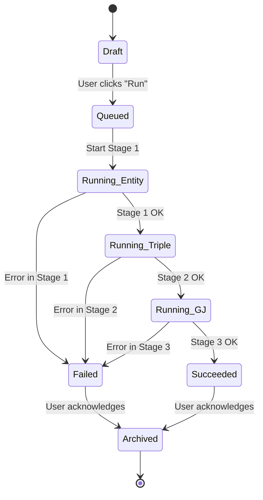

# GraphJudge Streamlit Refactoring: Design Document

**Version:** 2.0
**Date:** 2025-09-12
**Status:** Refactoring Specification
**Author:** Senior Software Engineer
**Purpose:** Refactoring `run_entity.py`, `run_triple.py`, `run_gj.py` for Streamlit Integration

---

## 1) Abstract

This document specifies the refactoring strategy for transforming three complex CLI-based pipeline scripts (`chat/run_entity.py`, `chat/run_triple.py`, `chat/run_gj.py`) into clean, modular components optimized for the **GraphJudge Streamlit Pipeline**. The original scripts contain intricate logic with extensive file I/O, logging systems, rate limiting, caching mechanisms, and complex async operations that are not well-suited for direct integration into a web application. This refactoring aims to extract core business logic while creating clean, testable, and maintainable modules specifically designed for the Streamlit environment.

**Key Refactoring Goals:**
1. **Simplify Complex Logic**: Extract core AI pipeline functionality from heavy CLI scripts (2000+ lines each)
2. **Clean API Design**: Create simple, focused interfaces replacing complex async file-based workflows  
3. **Streamlit-Optimized Architecture**: Leverage session state instead of file-based data persistence
4. **Maintainable Codebase**: Separate concerns between UI, business logic, and external API integrations
5. **Preserved Functionality**: Maintain all essential features while removing CLI-specific complexity

The refactoring strategy focuses on creating lightweight, focused modules that preserve the sophisticated NLP capabilities while providing a clean foundation for the Streamlit web interface.

## 2) Refactoring Challenge Analysis

### Current State Assessment

The existing CLI scripts present significant integration challenges:

**`chat/run_entity.py` (~800+ lines):**
- Complex async entity extraction with GPT-5-mini
- Intricate file-based caching system with hash-based storage
- Custom TerminalLogger class with timestamped file outputs
- Rate limiting with exponential backoff mechanisms
- Manual directory creation and path resolution
- Integration with separate `path_resolver.py` module

**`chat/run_triple.py` (~750+ lines):**
- Enhanced JSON schema validation with Pydantic models
- Text chunking and pagination for large inputs
- Complex prompt engineering with structured outputs
- Post-processing pipeline integration
- Comprehensive statistics tracking and logging
- Multiple output format generation

**`chat/run_gj.py` (~2200+ lines):**
- Multi-API integration (Perplexity, Gemini, KIMI)
- Gold label bootstrapping with RapidFuzz similarity matching
- Explainable reasoning mode with detailed output
- Complex error handling and retry mechanisms
- CSV and JSON output formatting
- Integration with external dataset libraries

### Refactoring Strategy

**Core Principle:** Extract essential business logic while eliminating CLI-specific complexity

**Target Architecture:**
1. **Simple Function Interfaces**: Replace complex async file workflows with clean synchronous functions
2. **Streamlit Session State**: Use in-memory data passing instead of file-based intermediate storage
3. **Simplified Error Handling**: Surface user-friendly errors without complex retry mechanisms
4. **Focused Modules**: Create single-responsibility modules for each pipeline stage
5. **Minimal Dependencies**: Reduce external library requirements where possible

### Success Criteria

- **Functionality Parity**: All core NLP capabilities preserved
- **Code Reduction**: Target 70%+ reduction in lines of code per module
- **Testability**: Clean interfaces suitable for comprehensive unit testing
- **Maintainability**: Clear separation of concerns and minimal coupling
- **Performance**: Comparable processing speed with reduced overhead

## 3) Refactored Module Requirements

### Core Module Functional Requirements

**Refactored Entity Module (`streamlit_pipeline/core/entity_processor.py`):**
-   **FR‑E1:** Provide clean function interface: `extract_entities(text: str) -> EntityResult`
-   **FR‑E2:** Preserve GPT-5-mini entity extraction capabilities from original script
-   **FR‑E3:** Implement in-memory result storage instead of file-based output
-   **FR‑E4:** Include essential error handling without complex retry mechanisms
-   **FR‑E5:** Maintain core text denoising functionality in simplified form

**Refactored Triple Module (`streamlit_pipeline/core/triple_generator.py`):**
-   **FR‑T1:** Provide clean function interface: `generate_triples(entities: List[str], text: str) -> TripleResult`
-   **FR‑T2:** Preserve JSON schema validation and structured output generation
-   **FR‑T3:** Implement text chunking logic for large inputs in simplified form
-   **FR‑T4:** Maintain prompt engineering sophistication while reducing complexity
-   **FR‑T5:** Support essential post-processing without external pipeline dependencies

**Refactored Graph Judge Module (`streamlit_pipeline/core/graph_judge.py`):**
-   **FR‑GJ1:** Provide clean function interface: `judge_triples(triples: List[Triple]) -> JudgmentResult`
-   **FR‑GJ2:** Support primary API integration (focus on Perplexity API initially)
-   **FR‑GJ3:** Preserve core graph judgment logic while simplifying multi-API complexity
-   **FR‑GJ4:** Provide binary judgment results with optional confidence scores
-   **FR‑GJ5:** Support explainable reasoning mode in simplified form

**Integration Requirements:**
-   **FR‑I1:** Seamless data flow between modules using Python data structures
-   **FR‑I2:** Streamlit-compatible progress indication and error reporting
-   **FR‑I3:** Session state management for intermediate results
-   **FR‑I4:** Unified configuration system for API keys and model parameters

### Non‑Functional Requirements

-   **Performance:**
    -   UI should load in < 3 seconds.
    -   p95 latency for a single, non-cached inference stage (e.g., entity extraction for a 1000-word text) should be under 60 seconds, subject to external API performance.
-   **Reliability:**
    -   The application should handle API failures and script errors gracefully, displaying a user-friendly error message.
    -   Target: 99% success rate for pipeline runs, excluding external API failures.
-   **Cost:**
    -   The application should use caching for identical inputs to minimize redundant API calls and associated costs.
    -   **TODO:** Cost ceiling is {{cost_ceiling}}.
-   **Security:**
    -   API keys must be managed via environment variables (`.env` file or server-side configuration), not hardcoded or exposed in the frontend.
-   **Privacy:**
    -   Input text and results are considered ephemeral and tied to a user's session. No long-term storage of user data is required.
    -   **TODO:** Data sources are {{data_sources}}, with PII classification: {{pii?}}.
-   **Accessibility:** The app should adhere to basic web accessibility standards (e.g., legible fonts, clear contrast).
-   **Localization:** The UI will be in English. The underlying models are optimized for Chinese, but the UI does not require localization.

These requirements define a clear scope for an internal tool focused on functionality and usability over large-scale production concerns.

## 4) Assumptions & Constraints

-   **Technical Assumptions:**
    -   The core logic of `run_entity.py`, `run_triple.py`, and `run_gj.py` can be refactored into importable functions.
    -   The scripts' existing file-based input/output can be adapted to work within a temporary directory structure managed by the Streamlit app.
-   **Data Assumptions:**
    -   The input is UTF-8 encoded text.
    -   The models perform best on classical Chinese text, as that is what they were optimized for.
-   **Legal/Compliance:**
    -   The use of OpenAI and Perplexity APIs is subject to their respective terms of service.
    -   **TODO:** Project must adhere to {{compliance_requirements}}.
-   **Environment Constraints:**
    -   The application will run as a single-process Streamlit server.
    -   API keys for OpenAI and Perplexity must be provided as environment variables.

The primary constraint is the reliance on the existing scripts, making refactoring a key prerequisite.

## 5) User Flows

The primary user journey involves submitting text and observing the three-stage pipeline execute, with clear outputs at each step.

```mermaid
flowchart TD
    A[Start] --> B{User enters text in UI};
    B --> C[User clicks "Run Pipeline"];
    C --> D[Stage 1: Entity Extraction];
    D --> E{Show Entities & Denoised Text};
    E --> F[Stage 2: Triple Generation];
    F --> G{Show Generated Triples};
    G --> H[Stage 3: Graph Judging];
    H --> I{Show Final Judged Triples};
    I --> J[End];

    %% Error/Empty States
    D --> D_Error{"API Error?"};
    D_Error -- Yes --> D_Error_Msg[Show Error Message & Stop];
    D_Error -- No --> D_Empty{"No Entities?"};
    D_Empty -- Yes --> D_Empty_Msg[Show "No Entities Found" & Stop];
    D_Empty -- No --> E;

    F --> F_Error{"API Error?"};
    F_Error -- Yes --> F_Error_Msg[Show Error Message & Stop];
    F_Error -- No --> G;

    H --> H_Error{"API Error?"};
    H_Error -- Yes --> H_Error_Msg[Show Error Message & Stop];
    H_Error -- No --> I;
```

-   **Steps:**
    1.  **Input:** The user pastes text into a `st.text_area`.
    2.  **Initiation:** The user clicks a `st.button`, which triggers the main orchestration function. The UI shows a spinner or progress bar.
    3.  **Stage 1 (Entity):** The app calls the refactored `run_entity` logic. Logs are streamed to the UI.
    4.  **Output 1:** The results (entities, denoised text) are displayed using `st.expander` and `st.write`. If no entities are found, the pipeline stops.
    5.  **Stage 2 (Triple):** The app calls the `run_triple` logic, passing the paths to the intermediate files from Stage 1.
    6.  **Output 2:** The generated triples are displayed in a `st.dataframe`.
    7.  **Stage 3 (Judge):** The app calls the `run_gj` logic.
    8.  **Output 3:** The final data frame is updated with a "Judgment" column containing "Yes" or "No".
-   **Edge Cases:** If any stage fails due to an API error (e.g., 429 Rate Limit, 401 Auth), the process halts, and a `st.error` message is displayed with details.

This user flow prioritizes transparency, showing the user results and progress at each step of the pipeline.

## 6) System Architecture & Flows

The architecture is a simple, single-container setup ideal for Streamlit. It avoids complex distributed components, focusing on direct, in-process function calls.

```mermaid
sequenceDiagram
    participant Browser
    participant StreamlitApp as Streamlit App (Python)
    participant ServiceFunc as Service Functions <br> (run_entity, run_triple, run_gj)
    participant OpenAI_API as OpenAI/Perplexity API
    participant Cache as File System Cache <br> (e.g., ./cache)

    Browser->>+StreamlitApp: User pastes text and clicks "Run"
    StreamlitApp->>+ServiceFunc: call run_entity(text)
    ServiceFunc->>+Cache: Check for cached response
    Cache-->>-ServiceFunc: Return cached data if found
    ServiceFunc->>+OpenAI_API: POST /v1/chat/completions (if not cached)
    OpenAI_API-->>-ServiceFunc: Return entities
    ServiceFunc->>-Cache: Save response to cache
    ServiceFunc-->>-StreamlitApp: Return entities and denoised text
    StreamlitApp-->>Browser: Display Stage 1 results

    StreamlitApp->>+ServiceFunc: call run_triple(entities_path)
    ServiceFunc->>+OpenAI_API: POST /v1/chat/completions
    OpenAI_API-->>-ServiceFunc: Return triples
    ServiceFunc-->>-StreamlitApp: Return triples
    StreamlitApp-->>Browser: Display Stage 2 results

    StreamlitApp->>+ServiceFunc: call run_gj(triples_path)
    ServiceFunc->>+OpenAI_API: POST /v1/chat/completions (Perplexity)
    OpenAI_API-->>-ServiceFunc: Return judgments
    ServiceFunc-->>-StreamlitApp: Return judged triples
    StreamlitApp-->>-Browser: Display final results
```

-   **Data Flow:** The Browser sends user input to the Streamlit App. The app orchestrates calls to the service functions, which are Python modules derived from the existing `chat/` scripts. These functions handle the logic of calling external AI APIs. Intermediate data is stored on the local file system in a temporary directory.
-   **Failure Handling:** API calls within the service functions will be wrapped in `try...except` blocks. Rate limit errors (HTTP 429) will trigger a retry mechanism with exponential backoff. Other critical errors (e.g., auth, validation) will be propagated up to the Streamlit UI and displayed as user-friendly error messages. Timeouts will be configured for all external API calls.

This simple, in-process architecture minimizes complexity and is well-suited for a Streamlit application.

## 7) Data Usage & External AI APIs (no training)

-   **Data Sources:** User-provided text. The sensitivity is dependent on what the user inputs. For internal research use, this is acceptable.
-   **PII:** The system does not explicitly handle or redact PII. Users will be advised not to input sensitive personal information.
-   **Retention:** Data is ephemeral and stored only for the duration of a user session in temporary files. The file-based API cache (`/cache`) persists between runs but can be cleared manually.
-   **Prompt Construction:** Prompts are constructed within the `run_*.py` scripts as shown in the source code. They are specifically engineered for entity/triple extraction and judging tasks, with examples provided for in-context learning.
-   **Token Limits:** The scripts have hardcoded `max_tokens` values (e.g., `OPENAI_MAX_TOKENS = 4000`). The Streamlit app will enforce a reasonable input text length to avoid exceeding context window limits.
-   **Providers & APIs:**
    -   **Provider:** OpenAI, Perplexity.
    -   **APIs:** `litellm.completion` is used as a consistent interface.
        -   `run_entity` & `run_triple` use `gpt-5-mini`.
        -   `run_gj` uses `perplexity/sonar-reasoning`.
-   **Rate-Limit Behavior:** The `openai_config.py` and `run_entity.py` scripts include logic for handling rate limits, including calculating delays and implementing retries with backoff. The UI will surface a "Rate limit exceeded, retrying..." message.
-   **Idempotency:** API calls are not inherently idempotent. The file-based cache, using a hash of the prompt and parameters as the key, provides a form of idempotency for identical requests.

The system relies entirely on external, pre-trained models and manages data ephemerally.

## 8) Refactored Module Contracts

The Streamlit app will interact with clean, refactored functions that eliminate file-based complexity.

### Core Module Interfaces

| Module                    | Function Signature                                                   | Inputs                                                 | Outputs                                                | Error Handling                                          |
| ------------------------- | ------------------------------------------------------------------- | ------------------------------------------------------ | ------------------------------------------------------ | ------------------------------------------------------ |
| **Entity Processor**      | `extract_entities(text: str) -> EntityResult`                      | Raw Chinese text string                               | `EntityResult(entities: List[str], denoised_text: str, success: bool, error: Optional[str])` | Returns error message in result object, no exceptions |
| **Triple Generator**      | `generate_triples(entities: List[str], text: str) -> TripleResult` | List of entities, denoised text                       | `TripleResult(triples: List[Triple], metadata: dict, success: bool, error: Optional[str])` | Validation errors captured in result, graceful degradation |
| **Graph Judge**           | `judge_triples(triples: List[Triple]) -> JudgmentResult`            | List of Triple objects                                 | `JudgmentResult(judgments: List[bool], confidence: List[float], success: bool, error: Optional[str])` | API errors handled gracefully, partial results supported |

### Data Models

```python
@dataclass
class Triple:
    subject: str
    predicate: str
    object: str
    confidence: Optional[float] = None

@dataclass
class EntityResult:
    entities: List[str]
    denoised_text: str
    success: bool
    processing_time: float
    error: Optional[str] = None

@dataclass
class TripleResult:
    triples: List[Triple]
    metadata: dict  # Contains validation stats, chunk info, etc.
    success: bool
    processing_time: float
    error: Optional[str] = None

@dataclass
class JudgmentResult:
    judgments: List[bool]  # True/False for each triple
    confidence: List[float]  # Confidence scores (0-1)
    explanations: Optional[List[str]]  # For explainable mode
    success: bool
    processing_time: float
    error: Optional[str] = None
```

### Key Simplifications

1. **No File I/O**: All data passed as Python objects in memory
2. **Synchronous Execution**: Simplified from complex async patterns for Streamlit compatibility
3. **Unified Error Handling**: Errors returned as data, not raised as exceptions
4. **Self-Contained Results**: All metadata included in result objects
5. **Optional Features**: Advanced features (like explainable mode) made optional with simple flags

## 9) State Machines

The lifecycle of a single pipeline job can be modeled as a state machine.



-   **States:**
    -   **Draft:** The user is editing the input text.
    -   **Queued:** The user has clicked "Run," and the job is about to start.
    -   **Running (Entity/Triple/GJ):** An inference stage is actively in progress.
    -   **Failed:** An unrecoverable error occurred. The state includes the error message and stage.
    -   **Succeeded:** All stages completed successfully.
    -   **Archived:** The job is complete and results are displayed. A new job can be started.

This state machine clearly defines the lifecycle of a job from user input to final result.

## 10) Error Handling & Resilience

-   **Error Taxonomy:**
    -   **Configuration Errors:** Invalid or missing API keys. Handled on startup with a clear error message.
    -   **API Errors:**
        -   `401 Unauthorized`: Invalid API key. Stop and notify the user.
        -   `429 Rate Limit Exceeded`: Retry with exponential backoff (e.g., 2s, 4s, 8s). Notify the user of the delay.
        -   `5xx Server Error`: Retry up to 3 times.
    -   **Validation Errors:** The model returns malformed JSON. The script attempts to parse it; if it fails, the item is marked as an error, and the pipeline continues if possible.
    -   **File System Errors:** Unable to read/write intermediate files. Stop and report a critical error.
-   **Graceful Degradation:** If the Perplexity API for `run_gj` is down, the pipeline can be configured to stop after the triple generation, providing partial results instead of failing completely.

A robust error handling strategy is crucial for providing a good user experience and preventing silent failures.

## 11) Performance & Reliability

-   **SLOs/SLIs:**
    -   **Latency:** p95 end-to-end pipeline execution time for a standard 1000-word document < 3 minutes (highly dependent on external API performance).
    -   **Availability:** App uptime > 99.5% (for internal use).
    -   **Correctness:** Judgment success rate (non-errored responses) > 98%.
-   **Capacity & Concurrency:** The Streamlit app runs as a single-threaded, single-user-session model. Concurrency is managed by the underlying `asyncio` event loop and semaphore limits defined in `openai_config.py` (e.g., `OPENAI_CONCURRENT_LIMIT = 50`). This is sufficient for the target user base of a few researchers.

Performance and reliability targets are set for an internal tool, prioritizing user experience over high-throughput scaling.

## 12) Observability

-   **Structured Logging:** The existing scripts use Python's `logging` or custom `TerminalLogger` classes. These will be adapted to log to the Streamlit UI and a session-specific log file. Logs will include timestamps, stage, and status. PII will not be explicitly redacted but is not expected.
-   **Metrics:** Basic metrics will be tracked and displayed at the end of a run:
    -   End-to-end execution time.
    -   Time per stage.
    -   Number of successful/failed triples.
    -   Cache hit/miss ratio.
-   **Tracing:** A unique `run_id` will be generated for each pipeline execution and included in all log messages to trace a single run through the stages.

Observability will be focused on providing immediate feedback to the user within the application itself.

## 13) Security & Privacy

-   **Authentication/Authorization:** None. The app will be deployed internally on a trusted network.
-   **Secrets Management:** API keys will be loaded from an `.env` file or environment variables on the server, following the pattern in `config.py`. They will not be exposed to the client.
-   **Data Minimization:** Only the data required for the next stage is passed. Temporary files are deleted after the session ends (or on a schedule).
-   **Compliance:** Not applicable for this internal research tool.

Security measures are appropriate for an internal tool running on a secure network.

## 14) Deployment & Environments

-   **Environments:** A single `production` environment for internal use. Development occurs on local machines.
-   **CI/CD:** A simple GitHub Actions workflow will be set up to run a linter and smoke tests on push. Deployment will be a manual `git pull` and server restart.
-   **Configuration:** All configuration (API keys, model names) will be managed via environment variables.
-   **Rollback Plan:** Rollback will be performed by checking out the previous Git commit and restarting the Streamlit server.

The deployment strategy is minimal and manual, which is sufficient for the project's scope.

## 15) Testing Strategy & Matrix

| Test Type     | Method                                                              | Scope                                                                                             | Owner      |
| :------------ | :------------------------------------------------------------------ | :------------------------------------------------------------------------------------------------ | :--------- |
| **Unit**      | `pytest`                                                            | Test helper functions (e.g., prompt formatting, response parsing) in isolation.                   | Dev Team   |
| **Integration** | `pytest` with `pytest-asyncio`                                      | Test each pipeline stage (`run_entity`, `run_triple`, `run_gj`) with mocked API calls (`unittest.mock`). | Dev Team   |
| **E2E**       | Manual Golden Path Testing                                          | Test the full user journey in the Streamlit UI with a small, known text input and real API calls. | QA/Dev Team|
| **Smoke**     | Manual Checklist                                                    | A quick check to ensure the app starts and the main UI elements are present after deployment.     | Dev Team   |

-   **Smoke Test Checklist:**
    1.  [ ] Application loads without errors.
    2.  [ ] Text input area is visible.
    3.  [ ] "Run Pipeline" button is visible and enabled.
    4.  [ ] Run a short, known-good text snippet through the pipeline.
    5.  [ ] Verify that judged triples are displayed as the final output.

A multi-layered testing approach will ensure code quality and reliability.

## 16) Refactored Repository Structure

The refactored Streamlit pipeline will be organized with clear separation between refactored modules and original scripts.

```
GraphJudge_TextToKG_CLI/
├── streamlit_pipeline/
│   ├── app.py                          # Main Streamlit application
│   ├── core/                           # Refactored core modules (extracted from chat/)
│   │   ├── __init__.py
│   │   ├── entity_processor.py         # Refactored from run_entity.py
│   │   ├── triple_generator.py         # Refactored from run_triple.py
│   │   ├── graph_judge.py              # Refactored from run_gj.py
│   │   ├── models.py                   # Shared data models (Triple, EntityResult, etc.)
│   │   └── config.py                   # Simplified configuration management
│   ├── utils/                          # Shared utilities
│   │   ├── __init__.py
│   │   ├── api_client.py               # Simplified API client wrapper
│   │   ├── text_processing.py          # Common text processing functions
│   │   └── validation.py               # Input validation utilities
│   ├── ui/                            # UI components
│   │   ├── __init__.py
│   │   ├── components.py               # Reusable Streamlit components
│   │   └── display.py                  # Result display functions
│   ├── tests/                          # Comprehensive test suite
│   │   ├── __init__.py
│   │   ├── test_entity_processor.py    # Unit tests for entity module
│   │   ├── test_triple_generator.py    # Unit tests for triple module
│   │   ├── test_graph_judge.py         # Unit tests for judge module
│   │   ├── test_integration.py         # Integration tests
│   │   └── fixtures/                   # Test data and fixtures
│   ├── docs/
│   │   ├── spec.md                     # This refactoring specification
│   │   └── refactoring_guide.md        # Code extraction guidelines
│   └── .env                            # Environment variables
├── chat/                               # Original scripts (preserved for reference)
│   ├── run_entity.py                   # Original entity extraction script
│   ├── run_triple.py                   # Original triple generation script
│   ├── run_gj.py                       # Original graph judgment script
│   └── ... (other existing files)
├── ... (other existing folders)
└── README.md
```

### Key Architectural Decisions

**Core Module Design:**
- `entity_processor.py`: ~150-200 lines (vs. 800+ original)
- `triple_generator.py`: ~200-250 lines (vs. 750+ original)  
- `graph_judge.py`: ~300-400 lines (vs. 2200+ original)

**Separation Strategy:**
- **Original Scripts Preserved**: Keep `chat/` directory intact for reference and fallback
- **Clean Extraction**: Extract only essential business logic into `core/` modules
- **Shared Components**: Common functionality moved to `utils/` for reuse
- **Test-Driven Design**: Comprehensive test coverage for all refactored modules

**Dependencies Management:**
- Minimize external dependencies in refactored modules
- Isolate complex dependencies (e.g., RapidFuzz) to specific modules
- Use simple, well-tested libraries for core functionality

## 17) Public Interfaces per Module

-   **`streamlit_pipeline/app.py`**
    -   **Responsibility:** Renders the Streamlit UI and manages session state.
    -   **Public APIs:** None (it's the entry point).
-   **`streamlit_pipeline/domain/pipeline.py`**
    -   **Responsibility:** Orchestrates the three pipeline stages. Manages temporary files.
    -   **Public APIs:**
        -   `def run_full_pipeline(text: str) -> Dict:` - Executes the entire workflow and returns a dictionary with all intermediate and final results.
-   **`chat/*.py` (Refactored)**
    -   **Responsibility:** Encapsulates the logic for a single inference stage.
    -   **Public APIs (after refactoring):**
        -   `def execute_entity_stage(input_text: str, output_dir: str) -> StageResult:`
        -   `def execute_triple_stage(input_dir: str, output_dir: str) -> StageResult:`
        -   `def execute_gj_stage(input_file: str, output_dir: str) -> StageResult:`

Clear module responsibilities are defined to ensure a clean, maintainable codebase.

## 18) Alternatives, Dependencies, Risks

-   **Alternatives Considered:**
    -   **Microservices with FastAPI & React:** Rejected as overly complex for an internal tool. It would require significant infrastructure and development overhead.
    -   **Jupyter Widgets:** Considered but rejected because it offers a less polished user experience and is harder to deploy as a standalone service.
-   **Third-Party Dependencies:**
    -   `streamlit`: For the web UI.
    -   `litellm`: For interacting with OpenAI/Perplexity APIs.
    -   `pandas`: For data display.
    -   The existing dependencies of the `chat/` scripts.
-   **Risk Register:**
| Risk ID | Description                                                              | Likelihood | Impact | Mitigation                                                                                             | Owner      |
| :------ | :----------------------------------------------------------------------- | :--------- | :----- | :----------------------------------------------------------------------------------------------------- | :--------- |
| R-01    | The `chat/` scripts are difficult to refactor into importable modules.   | Medium     | High   | Use `subprocess` to call the scripts as a fallback, though this is less ideal.                         | Dev Team   |
| R-02    | Long-running inference tasks block the Streamlit UI thread.              | High       | Medium | Run inference in separate threads (`threading`) and use `st.spinner` to show progress.                 | Dev Team   |
| R-03    | Changes in the `chat/` scripts by the research team break the app.       | Medium     | High   | Establish clear contracts (see Section 9) and implement integration tests that mock the script outputs. | App/Research |
| R-04    | API key or other secrets are accidentally exposed.                       | Low        | High   | Enforce secrets management policy; use linters that scan for hardcoded secrets.                        | Dev Team   |

The choice of Streamlit and direct script integration is a pragmatic trade-off, favoring development speed over architectural purity.

## 19) Refactoring Timeline & Acceptance Criteria

### Refactoring Timeline

-   **Phase 1 (Week 1): Core Module Extraction**
    -   Extract `entity_processor.py` from `run_entity.py` with essential GPT-5-mini functionality
    -   Create clean data models (`models.py`) with `EntityResult`, `TripleResult`, `JudgmentResult`
    -   Set up basic test framework with mock API responses
    -   **Target:** Functional entity extraction module with 80%+ code reduction

-   **Phase 2 (Week 2): Triple Generation Refactoring**
    -   Extract `triple_generator.py` from `run_triple.py` preserving JSON schema validation
    -   Implement simplified text chunking for large inputs
    -   Create unified `api_client.py` wrapper for consistent API interactions
    -   **Target:** Working triple generation with validation and chunking support

-   **Phase 3 (Week 3): Graph Judge Simplification**
    -   Extract `graph_judge.py` from complex `run_gj.py` (2200+ lines → 300-400 lines)
    -   Focus on Perplexity API integration initially, defer multi-API complexity
    -   Implement basic explainable reasoning mode
    -   **Target:** Functional graph judgment with 85%+ complexity reduction

-   **Phase 4 (Week 4): Streamlit Integration & Polish**
    -   Integrate all refactored modules into Streamlit app
    -   Implement session state management for data flow
    -   Add comprehensive error handling and user feedback
    -   **Target:** Complete working Streamlit application

### Acceptance Criteria

**Technical Requirements:**
-   **Code Quality:** 70%+ reduction in lines of code per module
-   **Test Coverage:** 90%+ unit test coverage for all refactored modules
-   **Functionality Parity:** All essential NLP capabilities preserved
-   **Performance:** Comparable processing speed with reduced overhead
-   **Error Handling:** Graceful error reporting without complex retry mechanisms

**Task Completion Requirements:**
-   **Unit Test Execution:** All unit tests must pass before marking task as complete
-   **Integration Testing:** Module must integrate correctly with existing components
-   **Debugging Completion:** All identified bugs and issues must be resolved
-   **Task Documentation:** Task status must be updated in TASK.md only after all testing is complete

**Functional Requirements:**
-   Successful entity extraction from Chinese text using GPT-5-mini
-   Triple generation with JSON schema validation
-   Graph judgment with Perplexity API integration
-   Seamless data flow between all three stages
-   User-friendly error messages and progress indication

**Integration Requirements:**
-   Clean module interfaces suitable for unit testing
-   Streamlit-compatible synchronous execution
-   Session state management for intermediate results
-   Unified configuration system for API keys

### Success Metrics

**Maintainability:**
- Reduced cyclomatic complexity in all modules
- Clear separation of concerns between UI, business logic, and API integration
- Comprehensive documentation for all refactored components

**User Experience:**
- Simplified execution flow compared to CLI scripts
- Real-time progress feedback
- Clear error messages and recovery suggestions

**Development Velocity:**
- Faster iteration cycles due to reduced complexity
- Easier debugging with simplified data flow
- Improved testability with clean module interfaces

**Quality Assurance:**
- All unit tests pass consistently across different environments
- Integration tests validate module interactions
- Comprehensive debugging ensures production-ready code
- Task completion requires verified testing before status update

## 20) Glossary, References, Change Log

### Glossary

**Refactoring Terms:**
-   **Code Extraction:** The process of identifying and extracting essential business logic from complex CLI scripts
-   **Module Simplification:** Reducing complexity while preserving core functionality
-   **Interface Cleaning:** Creating simple, focused APIs that replace complex file-based workflows

**Technical Terms:**
-   **KG:** Knowledge Graph. A graph-structured data model representing knowledge
-   **Triple:** A single fact in a KG, composed of a subject, predicate, and object  
-   **ECTD Pipeline:** Entity Extraction, Text Denoising pipeline stage
-   **GraphJudge:** The overall project name and the third stage of the pipeline
-   **Session State:** Streamlit's in-memory data management system

**Original Scripts:**
-   **`run_entity.py`:** Complex 800+ line entity extraction script with GPT-5-mini
-   **`run_triple.py`:** Enhanced 750+ line triple generation with JSON schema validation
-   **`run_gj.py`:** Comprehensive 2200+ line graph judgment script with multi-API support

### References

-   [Streamlit Documentation](https://docs.streamlit.io/)
-   [LiteLLM Documentation](https://docs.litellm.ai/)
-   [Original Scripts Analysis](../../../chat/)
-   [CLAUDE.md Project Guidelines](../../../CLAUDE.md)
-   [GraphJudge_TextToKG_CLI README](../../../README.md)

### Change Log

-   **v1.0 (2025-09-11):** Initial Streamlit orchestrator specification
-   **v2.0 (2025-09-12):** Updated to focus on refactoring strategy for `run_entity.py`, `run_triple.py`, `run_gj.py`
    -   Added comprehensive analysis of original scripts complexity
    -   Specified clean module interfaces and data models
    -   Defined refactoring timeline with specific code reduction targets
    -   Updated architecture to emphasize simplification and maintainability
    -   Provided detailed module contracts and repository structure
    -   Added success metrics focused on code quality and maintainability

---

## Summary

This specification provides a comprehensive refactoring strategy for transforming three complex CLI-based pipeline scripts into clean, maintainable modules optimized for Streamlit integration. The approach prioritizes simplification while preserving essential NLP capabilities, targeting significant code reduction and improved maintainability. The refactoring will enable researchers to access the full GraphJudge pipeline through a user-friendly web interface without the complexity of CLI script management.
